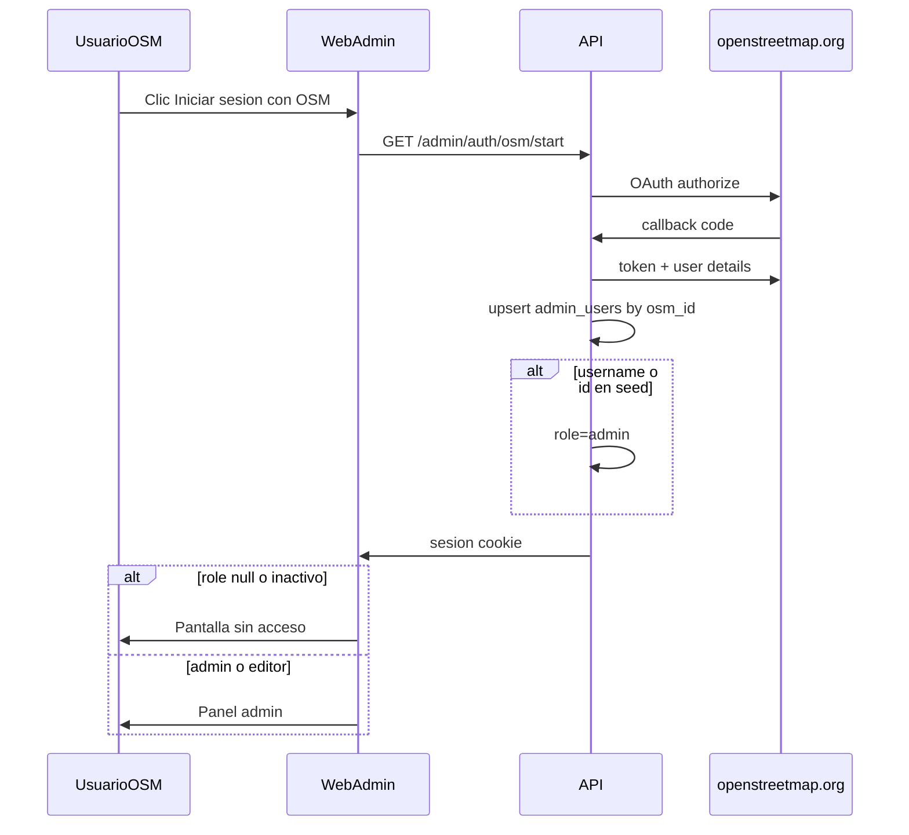
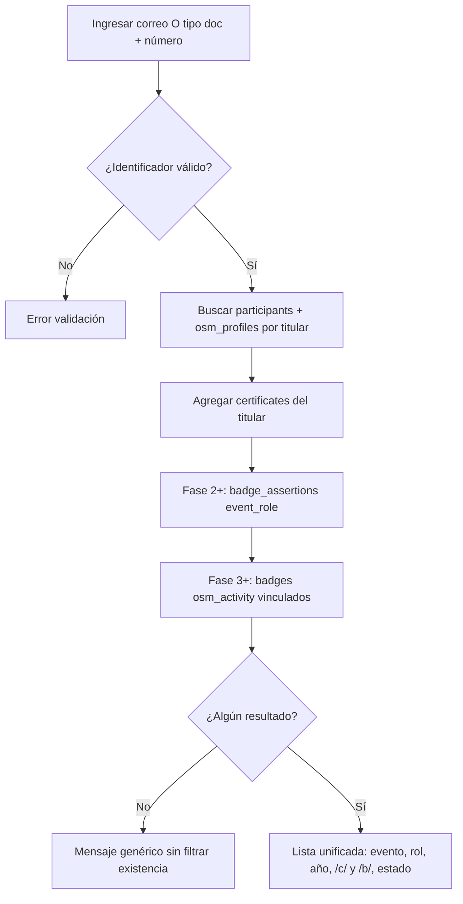
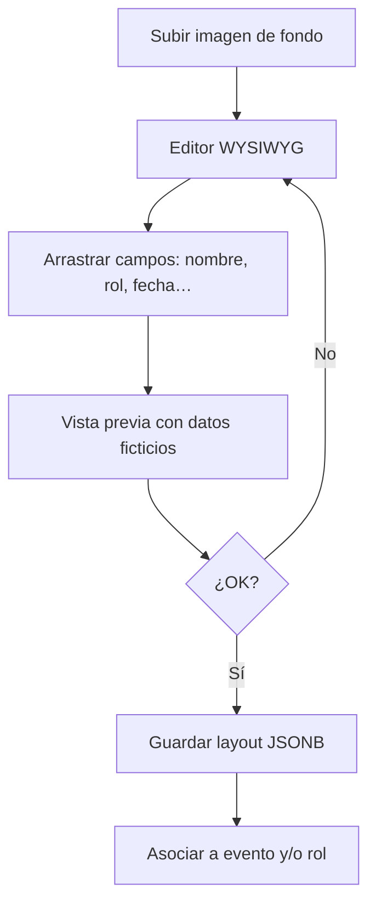
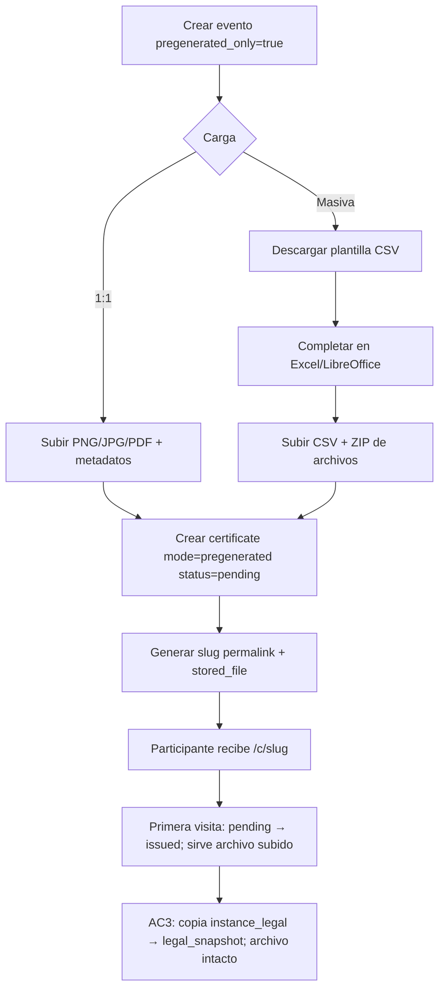
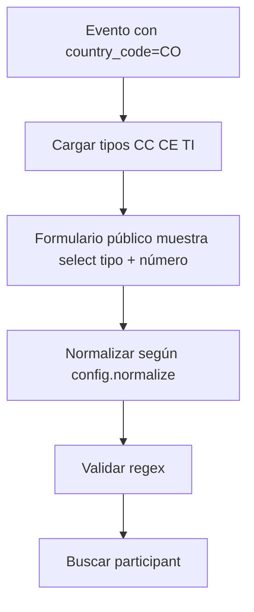
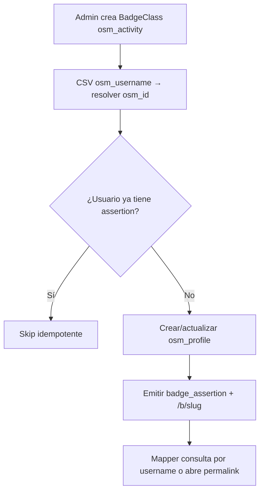

# Flujos funcionales

**Versión:** 1.0  
**Fecha:** 2026-06-06

---

## 1. Actores

| Actor | Descripción |
|-------|-------------|
| Participante | Consulta permalink o busca certificados (sin cuenta) |
| Editor / Admin | Panel tras OAuth OSM; roles en `admin_users` |
| Verificador | Abre permalink (LinkedIn, empleador) |
| Sistema | Renderiza PDF, valida, registra accesos |

---

## 1bis. Flujo — Login admin (OAuth OSM)



**Reglas:**

1. Sin cuenta OSM no hay acceso al panel.
2. Cualquiera con OSM puede completar OAuth; sin rol asignado ⇒ “sin acceso” / APIs 403.
3. Un `admin` asigna roles en `/admin/users` (HU-7.4).
4. Bootstrap: `SEED_ADMIN_OSM_USERNAMES` / `SEED_ADMIN_OSM_IDS` → `admin` en el primer match OAuth.

---

## 2. Flujo central — Permalink

```mermaid
sequenceDiagram
    participant U as Usuario
    participant W as Web/API
    participant DB as Base de datos
    participant R as Renderizador

    U->>W: GET /c/{slug}
    W->>DB: Buscar certificate por slug
    alt No existe
        W-->>U: 404 No encontrado
    else Revocado
        W-->>U: Página revocada (sin documento)
    else Válido
        alt mode = pregenerated
            alt Primera visita (pending → issued)
                W->>DB: issued_at=now; AC3: legal_snapshot (archivo intacto)
            end
            W->>DB: Obtener stored_file
            W-->>U: Servir imagen/PDF almacenado
        else mode = generated
            alt Estado failed
                W-->>U: Página “no se pudo generar” (sin Puppeteer)
            else Primera emisión (pending → issued)
                W->>R: Renderizar layout + datos (+ legal_snapshot AC3)
                alt Render OK
                    R-->>W: PDF/imagen
                    W->>DB: Guardar stored_file (inmutable)
                    W-->>U: Documento + página verificable
                else Alcanza PDF_MAX_ISSUE_ATTEMPTS
                    W->>DB: status=failed
                    W-->>U: Página “no se pudo generar”
                end
            else Ya issued
                W->>DB: Obtener stored_file cacheado
                W-->>U: Documento + página verificable
            end
        end
        W->>DB: INSERT permalink_access_log
    end
```

### Reglas

1. **Único disparador de emisión:** `GET /api/v1/public/certificates/{slug}` (metadata) si el cliente **no** es crawler/preview **y** el certificado está `pending`. Pasa `pending` → `issued`, fija `issued_at`. En modo `generated` **genera y almacena** el PDF; en `pregenerated` solo activa el estado. Si está `failed`, metadata **no** emite.
2. La SPA `/c/` y la búsqueda llaman **siempre** a metadata antes de `/file`.
3. **`/file` en `pending` o `failed` → HTTP 409** (no emite). En `issued`, sirve el archivo almacenado (no re-renderiza).
4. El **slug no cambia** nunca.
5. En AC3, al pasar a `issued` se escribe `legal_snapshot` en **ambos** modos. Solo `generated` incrusta esos valores en el PDF; el pregenerado no se reescribe.
6. Soft-delete del evento **no** invalida permalinks ya emitidos.
7. Metadatos Open Graph (Fase 2): crawlers reciben preview **sin** emitir. API verify JSON en Fase 2.
8. **Contrato rutas:** ver [10 §4.2](./10-diseno-codigo-y-anexos.md).

---

## 3. Flujo — Búsqueda pública por identidad (sin permalink)

**Principio:** siempre se exige identificación del titular. **Nunca** listar asistentes por evento/año/sede solos.



### Reglas de privacidad

| Permitido | Prohibido |
|-----------|-----------|
| Buscar **mis** credenciales con mi correo/doc | Buscar por evento + año sin identificador |
| Buscar **mis** badges OSM con mi **osm_id** | Enumerar participantes de un evento (público) |
| Ver permalink `/c/` o `/b/` si lo conozco | API pública de listados masivos |
| Admin autenticado: listar por evento | Scraping / barrido de slugs sin rate limit |

Tras **supresión ARCO** (`erased_at`): la búsqueda por el email/documento antiguos **no** devuelve filas. `/c/` del slug sigue resolviendo como revocado, sin PII.

### Abuso, bots y carga del servidor

Detalle de implementación: [10 §10](./10-diseno-codigo-y-anexos.md#10-seguridad-abuso-y-protección-de-carga).

| Regla | Aplicación |
|-------|------------|
| Rate limit búsqueda | 10 req/min/IP → 429 |
| Rate limit permalinks `/c/`, `/b/`, PDF | 60 req/min/IP → 429 |
| Turnstile (captcha) | Fase 3 en búsqueda, si hace falta |
| Sin sitemap de slugs | Evitar descubrimiento masivo |
| `robots.txt` + señales anti-IA | Reducir scrapers / entrenamiento; verify humano y backpacks OK |
| PDF `issued` | Solo storage; no Puppeteer en cada visita |
| Concurrencia Chromium | Máx. 1 (`PDF_CONCURRENCY`); volumen 50–200 certs/evento ([01 §5.1](./01-vision-y-alcance.md#51-volumen-y-desempeño--decisión-cerrada)) |

### Ejemplo

> CC 1234567890 → FLISoL 2023 asistente, FLISoL 2024 ponente, Mapathon 2026 voluntario, badge 100 changesets.

La sede aparece **en el resultado**, no como filtro de búsqueda.

---

## 4. Flujo — Múltiples roles

```mermaid
flowchart LR
    P[Ana García - Evento X] --> C1[Cert slug-a: asistente]
    P --> C2[Cert slug-b: voluntario]
    C1 --> U1[/c/slug-a]
    C2 --> U2[/c/slug-b]
```

**Alta admin:**

1. Crear o localizar `participant` (Ana + evento + identificación).
2. Crear `certificate` rol=asistente → genera slug-a.
3. Crear `certificate` rol=voluntario → genera slug-b.
4. Cada uno puede ser `generated` o `pregenerated` independientemente.

---

## 5. Flujo — Editor visual de plantilla



**Campos arrastrables — catálogo canónico de tokens (`packages/shared` / editor):**

| Grupo | Tokens |
|-------|--------|
| Participante | `full_name`, `document`, `role_label`, `activity_title` |
| Evento | `event_name`, `venue_name`, `event_date` |
| Sistema | `certificate_slug` (texto del slug), `permalink_qr` (QR → URL `/c/{slug}`) |
| Instancia AC3 | `legal.entity_name`, `legal.nit`, `legal.representative`, `legal.folio`, `legal.issue_city`, `legal.issue_date`, `legal.disclaimer`, `legal.signer.{n}.name`, `legal.signer.{n}.title`, `legal.signer.{n}.signature` (`n` = 1..8) |

`certificate_slug` y `permalink_qr` son **dos** tokens distintos. Lista única de producto: esta tabla + [08 §3](./08-datos-legales-ac3-plantilla.md) para `legal.*`. El schema `layout` valida solo estos `field` (`legal.signer.{n}.*` con `n` ∈ 1..8).

Valores `legal.*` → config instancia + `folio` / `issued_at` del certificado. Resto → BD del participante/evento. `event_date` ≠ `legal.issue_date`.

---

## 6. Flujo — Certificado pregenerado



No se usa plantilla visual ni renderizador; el archivo subido **es** el certificado. Estado inicial **`pending`** (igual que generated); al pasar a `issued` se fija `issued_at` y se sirve el archivo ya almacenado (sin Puppeteer). En AC3 se escribe `legal_snapshot` en ese mismo paso (página `/c/` / verify); el binario no cambia. La **plantilla CSV** del panel solo estructura metadatos (`filename`, nombre, email, rol, …).

---

## 7. Flujo — Identificación por país



Para evento en otro país, se cargan tipos (y su `normalize`) desde `country_identity_config` sin despliegue de código nuevo.

---

## 8. Flujo — Instancias osm.lat vs AC3

Idénticos en lógica. Diferencias en render:

| Paso | osm.lat | AC3 |
|------|---------|-----|
| Página `/c/{slug}` | Branding comunitario | Branding AC3 |
| PDF generado | Sin capas `legal.*` | Capas `legal.*` si están en plantilla + config |
| Issuer OB | Comunidad OSM Latam | Misma config AC3 (nombre/NIT en issuer.json) |

**URLs:**

- https://certificados.osm.lat/c/{slug}
- https://certificados.ac3.org.co/c/{slug}

---

## 9. Flujo — Revocación y corrección

```
Editor/Admin POST /api/v1/admin/certificates/{id}/revoke
  → status = revoked, revoked_at = now(), revoke_reason?
  → badge event_role vinculado → revoked
  → audit_log certificate_revoke (misma transacción)
  → GET /c/{slug} muestra estado revocado (sin PDF)
  → API verify → { valid: false, reason: "revoked" }

Corrección de emitido:
  → revocar (arriba) + alta nueva del participante/rol (nuevo slug)
  → NO hay PATCH ni regeneración del PDF issued

Badge OSM (u otro) sin certificado:
  → POST /api/v1/admin/badges/{id}/revoke
```

---

## 10. Casos de prueba sugeridos

| # | Caso | Esperado |
|---|------|----------|
| T1 | Permalink válido certificado generado | PDF correcto, 200 |
| T2 | Mismo slug segunda visita | Mismo contenido |
| T3 | Participante 2 roles | 2 slugs distintos en búsqueda |
| T4 | Evento 1 sede (**admin**/CSV) | Formulario admin sin selector sede; sede inferida |
| T5 | Evento 3 sedes (**admin**/CSV) | Selector de sede visible en alta admin/CSV |
| T6 | Doc CO CC + número con puntos | Encuentra certificados (búsqueda **pública**; `normalize: digits`) |
| T7 | Certificado pregenerado | Sirve archivo original |
| T8 | Revocado | Permalink sin documento descargable |
| T9 | AC3 generado | Incluye NIT y folio en PDF y en `/c/` vía snapshot |
| T10 | osm.lat generado | Sin NIT ni folio |
| T11 | CSV 2 filas mismo doc distinto rol | 2 certificates |
| T12 | Instancias separadas | Slug en AC3 no existe en osm.lat |
| T17 | Activar `generated` sin `default_template_id` | **400**; el evento sigue `draft` |
| T18 | Alta `generated` sin plantilla resoluble | **400**; no se crea `pending` (CSV: lote 0 filas) |
| T19 | Render falla `PDF_MAX_ISSUE_ATTEMPTS` veces | Pasa a `failed`; metadata posterior **no** lanza Puppeteer; `/file` **409** |
| T20 | `POST …/retry-issue` sobre `failed` | Vuelve a `pending` (`issue_attempts=0`); la siguiente visita humana emite |
| T22 | CSV rol fuera de `allowed_roles` | **0** filas; informe campo `role` |
| T23 | ZIP falta archivo / sobra archivo | Lote **0**; `ZIP_FILE_MISSING` / `ZIP_FILE_UNEXPECTED` |
| T24 | Unique violation de slug | Reintenta nanoid (máx. 5); no expone slug secuencial |
| T25 | ZIP con `../` en una entrada | Lote **0**; no escribe en disco fuera del basename |
| T26 | PNG o PDF con magic bytes / JS inválidos | **400**; no se almacena |
| T27 | Dos `transitionToIssued` AC3 concurrentes (certs distintos) | Folios consecutivos, UNIQUE, sin duplicar `last_folio` |
| T28 | AC3: render falla tras reservar folio; luego `retry-issue` | Mismo `folio`; no incrementa otra vez |
| T29 | Revocar AC3 `issued` y emitir otro para el mismo participante+rol | El folio revocado **no** se reutiliza; el nuevo toma el siguiente |
| T30 | AC3: 2 firmantes en slots 1 y 2; plantilla con capas `legal.signer.1.*` y `legal.signer.2.*` | PDF y snapshot incluyen ambos; `/c/` muestra nombres/cargos |
| T31 | Capa `legal.signer.3.signature` sin fila en slot 3 | Emisión OK; capa vacía |
| T32 | Borrar firmante slot 1; slot 2 intacto | Tokens `legal.signer.2.*` siguen resolviendo al mismo firmante |
| T33 | AC3: `event_date` del evento ≠ día del `transitionToIssued` | PDF y `/c/` muestran ambas fechas; `legal.issue_date` = `issued_at` en `America/Bogota` |
| T34 | Preview plantilla AC3 | `legal.issue_city` y `legal.disclaimer` = config; `legal.folio` y `legal.issue_date` = “—”; no incrementa `last_folio` ni escribe `issued_at` |
| T35 | AC3: emitir, luego PATCH del disclaimer | El `issued` conserva el texto del snapshot; el preview usa el nuevo |
| T36 | Certificado `issued`: `/c/` y metadata | Incluyen `checksum_sha256` (64 hex) e `issued_at`; coinciden con `stored_files`; el PDF no contiene el hash como capa |
| T37 | `POST …/participants/{id}/erase` (admin) | PII anonimizada; certs `revoked` + PDF borrado; búsqueda por email viejo vacía; `/c/` sin nombre/doc; `audit_log` `participant_erase` |
| T38 | CSV participantes aceptado; editor llama `GET …/audit-log` | Fila `participant_csv_import`; editor recibe **403**; admin ve la fila |
| T39 | PATCH rol de usuario (admin) | Fila `user_role_change` con `old_role`/`new_role`; si el INSERT de audit falla → **500** y el rol **no** cambia |

---

## 11. Casos de prueba — Open Badges (Fases 2 y 3)

| # | Caso | Fase | Esperado |
|---|------|------|----------|
| T13 | Alta certificado → badge pending; cert issued → badge issued | 2 | Assertion creada en pending al alta; `/b/` público solo tras issued; visitar `/b/` pending **no** emite; cert `failed` deja el badge en `pending` |
| T14 | Import CSV osm_id | 3 | Assertions emitidas idempotentes |
| T15 | Revocar certificado | 2 | Badge evento revocado |
| T16 | Badge OSM sin certificado | 3 | Solo `/b/`, sin `/c/` |
| T21 | AC3 pregenerado → issued | 2 | `/c/` y verify muestran `legal_snapshot` (folio, firmantes, ciudad/`issued_at`, disclaimer); el binario **no** cambia; config nueva no altera la página |

---

## 12. Flujo — Badge de evento (automático)

```mermaid
sequenceDiagram
    participant S as Sistema
    participant C as /c/slug
    participant B as /b/slug

    S->>S: Alta admin → certificate pending
    S->>S: Asegurar BadgeClass event_role (allowed_roles; también en draft)
    S->>S: Crear badge_assertion pending + slug /b/
    S->>S: certificate → issued (primera visita)
    S->>S: badge pending → issued
    Note over C,B: evidence_url = URL del certificado
    S-->>B: Permalink badge activo
```

**Nota:** las BadgeClass `event_role` se crean/actualizan al guardar `allowed_roles` (incluso en `draft`) con `UNIQUE (event_id, role_code)`; `code` inmutable al renombrar. `GET /badges/classes/{id}.json` **responde si la clase existe** (también con evento `draft`); no hay listado público que enumere clases de drafts.

---

## 13. Flujo — Badge actividad OSM (import externo)



---

## 14. Flujo — Job reglas OSM

```
1. BadgeClass con criteria_rule (ej. changesets_count >= 100)
2. Para cada osm_profile con email + linked_at (vinculados HU-10.5):
3. Consultar fuente de la métrica ([06 §5.1](./06-open-badges.md))
4. Si cumple → emitir assertion + evidence_metadata snapshot
5. Registrar `audit_log` `osm_job_run` (`admin_user_id` NULL, `metadata.source=job`)
```

---

## 14bis. Flujo — Vincular OSM ↔ email (HU-10.5)

```
1. Mapper abre /me → OAuth OSM público (callback distinto del admin)
2. Sesión mapper (cert_mapper_session); upsert osm_profiles
3. Si sin linked_at: pide email → SMTP código 20 min (osm_email_link_codes)
4. Confirma código → email + linked_at (1:1)
5. /me lista certificados del email + badges OSM del osm_id
```

---

## 15. API REST

Contrato completo en `apps/api/openapi.yaml` (generado en Fase 1; ampliado en Fases 2–3). Resumen:

| Método | Ruta | Fase | Uso |
|--------|------|------|-----|
| GET | `/c/{slug}` | 1 | Página HTML verify (SPA) |
| GET | `/api/v1/public/certificates/{slug}` | 1 | Metadata + lazy issue (no crawler) |
| GET | `/api/v1/public/certificates/{slug}/file` | 1 | Stream PDF; **409 si pending o failed** |
| POST | `/api/v1/admin/certificates/{id}/retry-issue` | 1 | `failed` → `pending`; no emite |
| POST | `/api/v1/public/search` | 1 | Búsqueda por correo/doc (solo certificados) |
| GET | `/api/v1/admin/auth/osm/start` | 1 | Inicio OAuth OSM |
| GET | `/api/v1/admin/auth/osm/callback` | 1 | Callback OAuth → sesión |
| GET | `/api/v1/admin/users` | 1 | Listar usuarios (solo admin) |
| PATCH | `/api/v1/admin/users/{id}` | 1 | Asignar rol / `is_active` (solo admin) |
| GET | `/api/v1/admin/audit-log` | 1 | Audit log (solo admin; HU-7.5) |
| CRUD | `/api/v1/admin/...` | 1 | Panel administración |
| GET | `/b/{slug}` | 2 | Badge público + JSON-LD |
| GET | `/badges/issuer.json` | 2 | Issuer OB |
| GET | `/badges/assertions/{uuid}.json` | 2 | Assertion OB |
| GET | `/api/v1/verify/c/{slug}` | 2 | `{ valid, status, issued_at, checksum_sha256, permalink }` |
| GET | `/api/v1/verify/b/{slug}` | 2 | Verificación máquina badge |
| POST | `/api/v1/admin/certificates/{id}/revoke` | 2 | Revocar certificado (+ badge evento) |
| POST | `/api/v1/admin/participants/{id}/erase` | 2 | Supresión ARCO (solo `admin`; HU-8.4) |
| POST | `/api/v1/admin/badges/{id}/revoke` | 2 | Revocar assertion (OSM o directa) |
| POST | `/api/v1/public/search` | 2 | Ampliado: incluye badges `event_role` |
| POST | `/api/v1/public/badges/osm` | 3 | Búsqueda por osm_id / username |
| GET | `/api/v1/public/auth/osm/start` | 3 | OAuth mapper (HU-10.5) |
| GET | `/api/v1/public/auth/osm/callback` | 3 | Callback → `mapper_sessions` |
| POST | `/api/v1/public/me/link-email` | 3 | Solicitar código (SMTP) |
| POST | `/api/v1/public/me/link-email/confirm` | 3 | Confirmar código → `linked_at` |
| GET | `/api/v1/public/me` | 3 | Vista unificada (requiere sesión + vínculo) |
| POST | `/api/v1/admin/badges/import` | 3 | Import awardees CSV |
| POST | `/api/v1/admin/badges/sync/{class_id}` | 3 | Job reglas OSM |

Stack: ver [09-plan-de-implementacion.md](./09-plan-de-implementacion.md). Producción en servidor comunitario osm.lat y servidor institucional AC3 (`certificados.ac3.org.co`).
