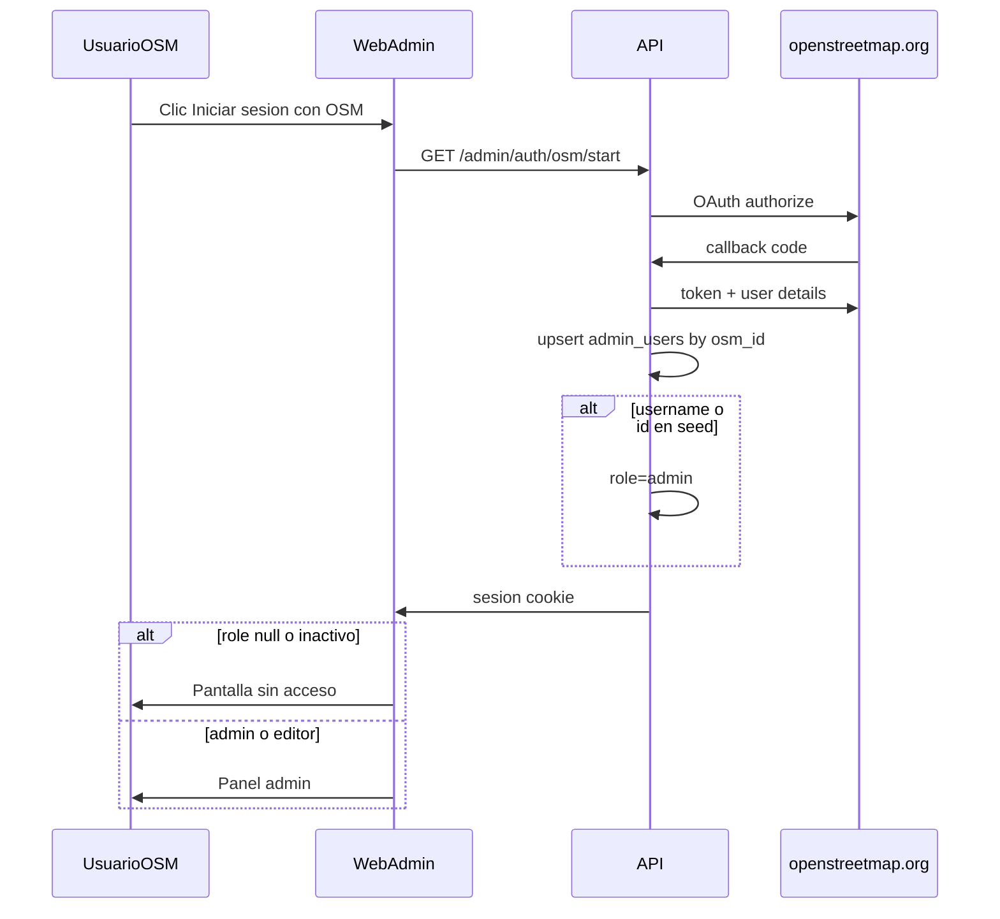
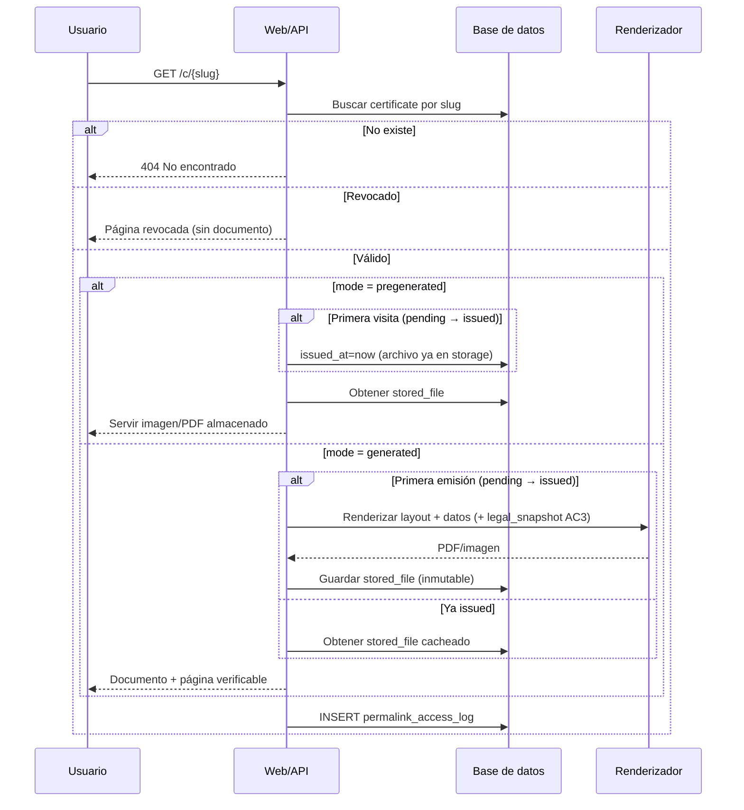
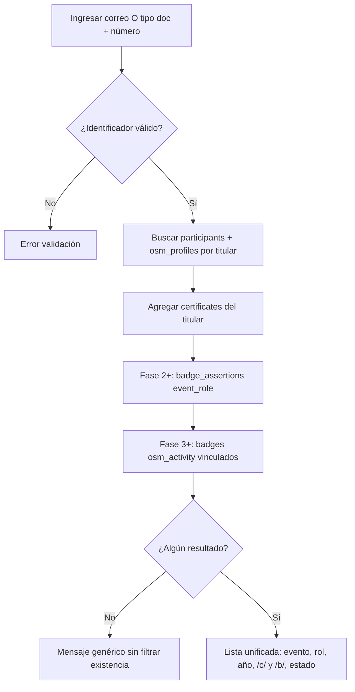
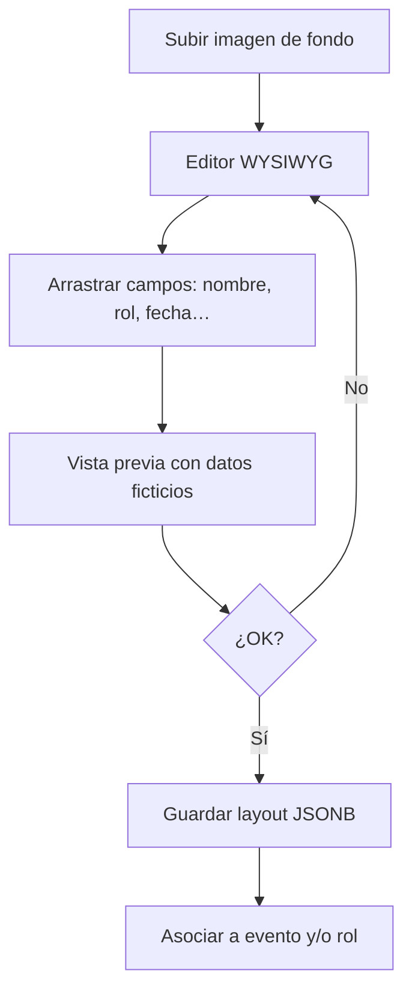
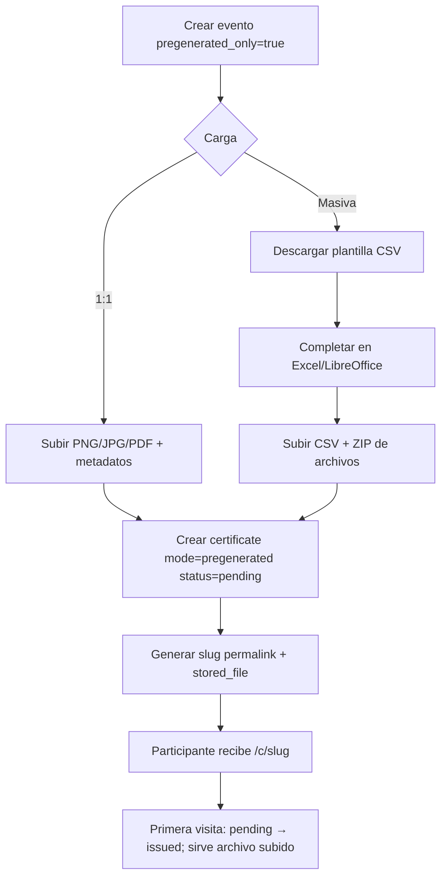
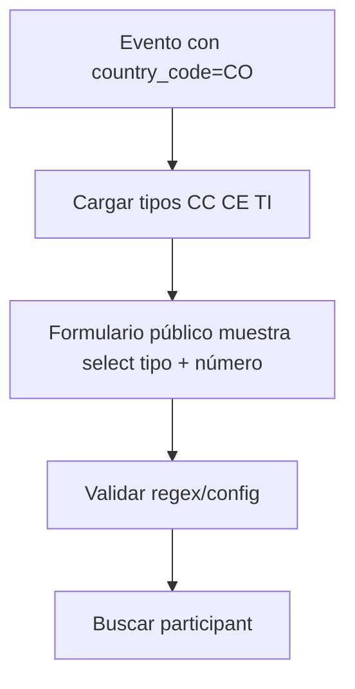
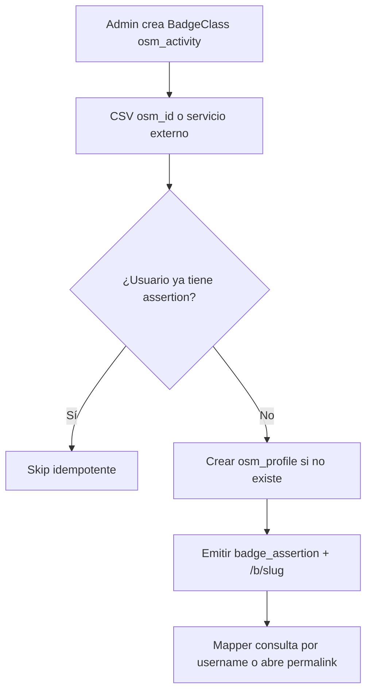

# Flujos funcionales

**Versión:** 1.0  
**Fecha:** 2026-06-06

---

## 1. Actores

| Actor | Descripción |
|-------|-------------|
| Participante | Consulta permalink o busca certificados (sin cuenta) |
| Editor / Admin | Panel tras OAuth OSM; roles en `admin_users` |
| Verificador | Abre permalink (LinkedIn, empleador) |
| Sistema | Renderiza PDF, valida, registra accesos |

---

## 1bis. Flujo — Login admin (OAuth OSM)



**Reglas:**

1. Sin cuenta OSM no hay acceso al panel.
2. Cualquiera con OSM puede completar OAuth; sin rol asignado ⇒ “sin acceso” / APIs 403.
3. Un `admin` asigna roles en `/admin/users` (HU-7.4).
4. Bootstrap: `SEED_ADMIN_OSM_USERNAMES` / `SEED_ADMIN_OSM_IDS` → `admin` en el primer match OAuth.

---

## 2. Flujo central — Permalink



### Reglas

1. **Primera visita** a un certificado `pending` dispara transición a `issued`, fija `issued_at`. En modo `generated` **genera y almacena** el PDF; en modo `pregenerated` solo activa el estado y **sirve el archivo ya subido**.
2. Visitas posteriores a certificado `issued` **sirven el archivo almacenado**, no re-renderizan.
3. El **slug no cambia** nunca.
4. En AC3, el PDF `generated` incluye `legal_snapshot` del momento de emisión.
5. Soft-delete del evento **no** invalida permalinks ya emitidos.
6. Metadatos Open Graph (Fase 2) y API verify JSON `GET /api/v1/verify/c/{slug}` (Fase 2) complementan la página pública.
7. **Contrato rutas:** HTML verify = SPA `/c/{slug}`; metadata + lazy issue = `GET /api/v1/public/certificates/{slug}`; binario = `…/file` (ver [10 §4.2](./10-diseno-codigo-y-anexos.md)).

---

## 3. Flujo — Búsqueda pública por identidad (sin permalink)

**Principio:** siempre se exige identificación del titular. **Nunca** listar asistentes por evento/año/sede solos.



### Reglas de privacidad

| Permitido | Prohibido |
|-----------|-----------|
| Buscar **mis** credenciales con mi correo/doc | Buscar por evento + año sin identificador |
| Buscar **mis** badges OSM con mi **osm_id** | Enumerar participantes de un evento (público) |
| Ver permalink `/c/` o `/b/` si lo conozco | API pública de listados masivos |
| Admin autenticado: listar por evento | Scraping / barrido de slugs sin rate limit |

### Abuso, bots y carga del servidor

Detalle de implementación: [10 §10](./10-diseno-codigo-y-anexos.md#10-seguridad-abuso-y-protección-de-carga).

| Regla | Aplicación |
|-------|------------|
| Rate limit búsqueda | 10 req/min/IP → 429 |
| Rate limit permalinks `/c/`, `/b/`, PDF | 60 req/min/IP → 429 |
| Turnstile (captcha) | Fase 3 en búsqueda, si hace falta |
| Sin sitemap de slugs | Evitar descubrimiento masivo |
| `robots.txt` + señales anti-IA | Reducir scrapers / entrenamiento; verify humano y backpacks OK |
| PDF `issued` | Solo storage; no Puppeteer en cada visita |
| Concurrencia Chromium | Máx. 1 por defecto (`PDF_CONCURRENCY`) |

### Ejemplo

> CC 1234567890 → FLISoL 2023 asistente, FLISoL 2024 ponente, Mapathon 2026 voluntario, badge 100 changesets.

La sede aparece **en el resultado**, no como filtro de búsqueda.

---

## 4. Flujo — Múltiples roles

```mermaid
flowchart LR
    P[Ana García - Evento X] --> C1[Cert slug-a: asistente]
    P --> C2[Cert slug-b: voluntario]
    C1 --> U1[/c/slug-a]
    C2 --> U2[/c/slug-b]
```

**Alta admin:**

1. Crear o localizar `participant` (Ana + evento + identificación).
2. Crear `certificate` rol=asistente → genera slug-a.
3. Crear `certificate` rol=voluntario → genera slug-b.
4. Cada uno puede ser `generated` o `pregenerated` independientemente.

---

## 5. Flujo — Editor visual de plantilla



**Campos arrastrables (paleta del editor):**

| Grupo | Tokens |
|-------|--------|
| Participante | `full_name`, `document`, `role_label`, `activity_title` |
| Evento | `event_name`, `venue_name`, `event_date` |
| Sistema | `certificate_slug`, `permalink_qr` |
| Instancia AC3 | `legal.entity_name`, `legal.nit`, `legal.representative`, `legal.signature` |

Valores `legal.*` → config instancia. Resto → BD del participante/evento. Ver [08-datos-legales-ac3-plantilla.md](./08-datos-legales-ac3-plantilla.md).

---

## 6. Flujo — Certificado pregenerado



No se usa plantilla visual ni renderizador; el archivo subido **es** el certificado. Estado inicial **`pending`** (igual que generated); al pasar a `issued` solo se fija `issued_at` y se sirve el archivo ya almacenado (sin Puppeteer). La **plantilla CSV** del panel solo estructura metadatos (`filename`, nombre, email, rol, …).

---

## 7. Flujo — Identificación por país



Para evento en otro país, se cargan tipos desde `country_identity_config` sin despliegue de código nuevo.

---

## 8. Flujo — Instancias osm.lat vs AC3

Idénticos en lógica. Diferencias en render:

| Paso | osm.lat | AC3 |
|------|---------|-----|
| Página `/c/{slug}` | Branding comunitario | Branding AC3 |
| PDF generado | Sin capas `legal.*` | Capas `legal.*` si están en plantilla + config |
| Issuer OB | Comunidad OSM Latam | Misma config AC3 (nombre/NIT en issuer.json) |

**URLs:**

- https://certificados.osm.lat/c/{slug}
- https://certificados.ac3.org.co/c/{slug}

---

## 9. Flujo — Revocación

```
Admin revoca certificate
  → status = revoked, revoked_at = now()
  → GET /c/{slug} muestra estado revocado
  → API verify retorna { valid: false, reason: "revoked" }
  → Open Badge vinculado marcado revoked
```

---

## 10. Casos de prueba sugeridos

| # | Caso | Esperado |
|---|------|----------|
| T1 | Permalink válido certificado generado | PDF correcto, 200 |
| T2 | Mismo slug segunda visita | Mismo contenido |
| T3 | Participante 2 roles | 2 slugs distintos en búsqueda |
| T4 | Evento 1 sede (**admin**/CSV) | Formulario admin sin selector sede; sede inferida |
| T5 | Evento 3 sedes (**admin**/CSV) | Selector de sede visible en alta admin/CSV |
| T6 | Doc CO CC + número válido | Encuentra certificados (búsqueda **pública**; sin sede) |
| T7 | Certificado pregenerado | Sirve archivo original |
| T8 | Revocado | Permalink sin documento descargable |
| T9 | AC3 generado | Incluye NIT en PDF |
| T10 | osm.lat generado | Sin NIT |
| T11 | CSV 2 filas mismo doc distinto rol | 2 certificates |
| T12 | Instancias separadas | Slug en AC3 no existe en osm.lat |

---

## 11. Casos de prueba — Open Badges (Fases 2 y 3)

| # | Caso | Fase | Esperado |
|---|------|------|----------|
| T13 | Alta certificado → badge pending; cert issued → badge issued | 2 | Assertion creada en pending al alta; `/b/` público solo tras issued; visitar `/b/` pending **no** emite |
| T14 | Import CSV osm_id | 3 | Assertions emitidas idempotentes |
| T15 | Revocar certificado | 2 | Badge evento revocado |
| T16 | Badge OSM sin certificado | 3 | Solo `/b/`, sin `/c/` |

---

## 12. Flujo — Badge de evento (automático)

```mermaid
sequenceDiagram
    participant S as Sistema
    participant C as /c/slug
    participant B as /b/slug

    S->>S: Alta admin → certificate pending
    S->>S: Asegurar BadgeClass event_role (allowed_roles; también en draft)
    S->>S: Crear badge_assertion pending + slug /b/
    S->>S: certificate → issued (primera visita)
    S->>S: badge pending → issued
    Note over C,B: evidence_url = URL del certificado
    S-->>B: Permalink badge activo
```

**Nota:** las BadgeClass `event_role` se crean/actualizan al guardar `allowed_roles` (incluso en `draft`). Los endpoints OB públicos de clases solo aplican con evento `active`.

---

## 13. Flujo — Badge actividad OSM (import externo)



---

## 14. Flujo — Job reglas OSM

```
1. BadgeClass con criteria_rule (ej. notes_closed >= 100)
2. Para cada osm_profile vinculado o lista candidatos:
3. Consultar API / servicio de stats
4. Si cumple → emitir assertion + evidence_metadata snapshot
5. Registrar en badge_import_batches o job log
```

---

## 15. API REST

Contrato completo en `apps/api/openapi.yaml` (generado en Fase 1; ampliado en Fases 2–3). Resumen:

| Método | Ruta | Fase | Uso |
|--------|------|------|-----|
| GET | `/c/{slug}` | 1 | Página HTML verify (SPA) |
| GET | `/api/v1/public/certificates/{slug}` | 1 | Metadata + lazy issue |
| GET | `/api/v1/public/certificates/{slug}/file` | 1 | Stream PDF/imagen |
| POST | `/api/v1/public/search` | 1 | Búsqueda por correo/doc (solo certificados) |
| GET | `/api/v1/admin/auth/osm/start` | 1 | Inicio OAuth OSM |
| GET | `/api/v1/admin/auth/osm/callback` | 1 | Callback OAuth → sesión |
| GET / PATCH | `/api/v1/admin/users` | 1 | Listar / asignar roles (solo admin) |
| CRUD | `/api/v1/admin/...` | 1 | Panel administración |
| GET | `/b/{slug}` | 2 | Badge público + JSON-LD |
| GET | `/badges/issuer.json` | 2 | Issuer OB |
| GET | `/badges/assertions/{uuid}.json` | 2 | Assertion OB |
| GET | `/api/v1/verify/c/{slug}` | 2 | Verificación máquina certificado `{ valid, status, … }` |
| GET | `/api/v1/verify/b/{slug}` | 2 | Verificación máquina badge |
| POST | `/api/v1/public/search` | 2 | Ampliado: incluye badges `event_role` |
| POST | `/api/v1/public/badges/osm` | 3 | Búsqueda por osm_id |
| POST | `/api/v1/admin/badges/import` | 3 | Import awardees CSV |
| POST | `/api/v1/admin/badges/sync/{class_id}` | 3 | Job reglas OSM |

Stack: ver [09-plan-de-implementacion.md](./09-plan-de-implementacion.md). Producción en servidor comunitario osm.lat y servidor institucional AC3 (`certificados.ac3.org.co`).
