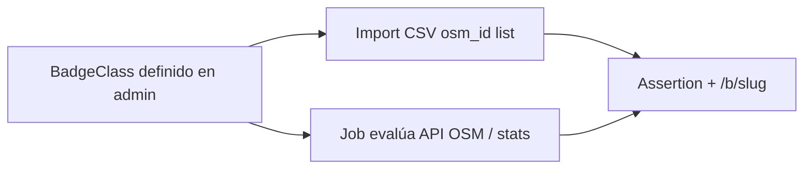
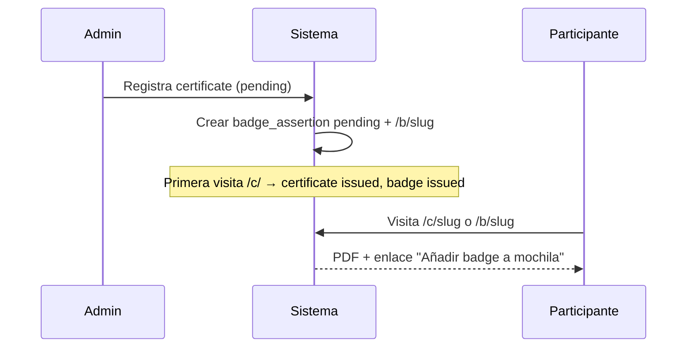

# Open Badges

**Versión:** 1.0  
**Fecha:** 2026-06-06  
**Alcance:** Módulo **integrado** del proyecto (no extensión opcional tardía).

---

## 1. Posición en el producto

Open Badges es un **pilar del sistema**, al mismo nivel que los certificados PDF:

| Credencial | Ruta | Formato | Caso de uso |
|------------|------|---------|-------------|
| Certificado | `/c/{slug}` | PDF / imagen | Eventos, diploma, LinkedIn, AC3 legal |
| Badge | `/b/{slug}` | **Open Badges 2.0** (JSON-LD, verificación *hosted*) | Backpack (Badgr, Open Badge Passport), logros OSM, complemento de evento |

**Decisión cerrada (v1.0):** el sistema emite **Open Badges 2.0** con verificación **hosted** (la URL pública de la assertion es la prueba de validez). No se emite OB 3.0 ni firma criptográfica en v1.0 — eso queda en [evolución futura](./01-vision-y-alcance.md#11-evolución-futura-post-v10) (migración a OBv3 + `proof`).

Un certificado de evento **genera automáticamente** un badge vinculado (BadgeClass del rol se materializa al definir `allowed_roles`, incluso en `draft`; `UNIQUE (event_id, role_code)`; ver HU-9.3).  
Un badge de actividad OSM **puede existir sin certificado**.

---

## 2. Dos familias de badges

### 2.1. Badge de evento (`type: event_role`)

| Aspecto | Detalle |
|---------|---------|
| Fuente | Emisión de `certificate` (rol en evento) |
| PDF | Sí, en `/c/{slug}` |
| Badge | Sí, en `/b/{slug}` — evidence apunta a `/c/{slug}` |
| BadgeClass | Por evento + rol (ej. "Ponente — Mapathon 2026") |
| Instancias | osm.lat y AC3 |

### 2.2. Badge de actividad OSM (`type: osm_activity`)

| Aspecto | Detalle |
|---------|---------|
| Fuente | Criterio externo o regla OSM |
| PDF | **No** |
| Badge | Sí, solo `/b/{slug}` |
| Ejemplos | Ver catálogo §5.1 (antigüedad, changesets, trazas, …) |
| Instancia | **Solo osm.lat** (AC3 no emite actividad OSM; HOT/TM = instancia futura) |
| Identidad | `osm_id` (+ `osm_username` actualizable); sin cédula ni email en el badge |
| Descubrimiento | Público por osm_id / username |

**Criterios externos — modos de emisión:**



> **v1.0 / Fase 3:** import CSV (M1) y job (M2) solo en **osm.lat**. Webhook: [evolución futura](./01-vision-y-alcance.md#11-evolución-futura-post-v10).

---

### 2.3. Recipient (identidad OB 2.0)

- Con email (`event_role`, o `osm_activity` con email vinculado HU-10.5): recipient **`IdentityObject`** con email **hasheado** (`hashed: true`) + **salt** aleatorio por assertion. El salt viaja **dentro** del JSON de la assertion (estándar OB 2.0); se cachea en `assertion_json`. No hace falta columna/`ENV` de salt global.
- Email siempre disponible en badges `event_role`: es obligatorio en participantes.
- Badges `osm_activity` se asocian a `osm_id`. **Sin email vinculado**, el recipient usa identidad OSM como URL estable bajo el dominio de la instancia (el id numérico es la identidad; no el username):

```json
{
  "type": "IdentityObject",
  "identityType": "url",
  "identity": "https://certificados.osm.lat/osm/users/{osm_id}",
  "hashed": false
}
```

(Contrato: identificador estable = `osm_id`, no username. La ruta `/osm/users/{osm_id}` puede ser página mínima o redirect al perfil OSM actual.)

**Verificación en v1.0:** (1) hosted — `GET /badges/assertions/{uuid}.json` debe seguir sirviendo la assertion mientras el badge esté `issued`; (2) páginas humanas `/c/{slug}` y `/b/{slug}`; (3) API máquina `GET /api/v1/verify/c/{slug}` y `/b/{slug}` (**Fase 2**). Visitar `/b/` en `pending` **no** emite el certificado.

---

## 3. Mapeo Open Badges 2.0

| OB 2.0 | Entidad en sistema |
|--------|-------------------|
| **Issuer (Profile)** | Config instancia + `badge_issuers` |
| **BadgeClass** | `badge_classes` |
| **Assertion** | `badge_assertions` |
| **Evidence** | URL `/c/` o perfil OSM / snapshot API |
| **Verification** | Hosted: `/badges/assertions/{uuid}.json`; UI: `/b/{slug}` |

---

## 4. Issuer por instancia

### osm.lat

```json
{
  "@context": "https://w3id.org/openbadges/v2",
  "type": "Issuer",
  "id": "https://certificados.osm.lat/badges/issuer.json",
  "name": "OSM Latam — Certificados y Badges",
  "url": "https://certificados.osm.lat",
  "description": "Certificados de eventos y badges por actividad en OpenStreetMap."
}
```

### AC3

```json
{
  "@context": "https://w3id.org/openbadges/v2",
  "type": "Issuer",
  "id": "https://certificados.ac3.org.co/badges/issuer.json",
  "name": "AC3 — Certificados institucionales",
  "url": "https://certificados.ac3.org.co",
  "description": "NIT … Certificados y badges de eventos con aval AC3."
}
```

---

## 5. Ejemplos de BadgeClass

### Evento

```json
{
  "type": "event_role",
  "code": "mapathon-monteria-2026-asistente",
  "name": "Asistente — Mapathon Montería 2026",
  "description": "Participó como asistente en el mapathon.",
  "image_url": "…/badges/images/mapathon-asistente.png",
  "criteria_narrative": "Asistió al evento presencial/virtual del 2 mar 2026.",
  "event_id": "uuid",
  "role_code": "asistente"
}
```

### Actividad OSM — catálogo inicial Fase 3 (§5.1)

Escalas acumulativas (un assertion por BadgeClass al cruzar umbral). Alineación changesets con tramos tipo HDYC en el extremo alto.

| Familia | metric | Umbrales (value) | Fuente v1.0 | Esfuerzo |
|---------|--------|------------------|-------------|---------|
| Antigüedad cuenta | `account_age_years` | 1, 5, 10, 20 | **OSM API user** | Bajo (Must job F3) |
| Changesets | `changesets_count` | 25, 100, 1000, 10000, 25000, 75000, 100000 | **OSM API user** | Bajo (Must job F3) |
| Trazas GPX | `traces_count` | 1, 10, 100, 1000, 5000 | **OSM API user** | Bajo (Must job F3) |
| Días mapeando | `mapping_days` | 7, 30, 100, 365, 1000, 2000 | Fuente a elegir en implementación (API/agregador disponible) | Medio (Should) |
| Diarios | `diary_entries` | 1, 5, 20, 100 | **CSV** hasta fuente estable | Alto |
| Amigos | `friends_count` | 1, 10, 50 | **CSV** | Alto |
| Notas abiertas | `notes_opened` | 1, 10, 100, 1000, 5000 | **CSV** (Notes API = evolución) | Alto |
| Notas cerradas | `notes_closed` | 1, 10, 100, 1000, 5000 | **CSV** (Notes API = evolución) | Alto |

Códigos ejemplo: `osm-changesets-100`, `osm-account-5y`, `osm-traces-1000`.

**Decisión cerrada — fuente por métrica:** no hay un proveedor global (p. ej. Overpass obligatorio). Cada `metric` declara su fuente en esta tabla. El job Must de F3 usa **`GET /api/0.6/user/{id}`** (bloque `user`) para antigüedad, changesets y trazas. Otras fuentes (Overpass, Notes API, planet, ohsome, …) solo si la fila de la métrica las admite o en evolución futura.

**Qué ya está cerrado (producto):** métricas, umbrales, códigos de BadgeClass y **fuente por métrica**.

**Qué queda a implementación:** la query/cliente concreto de cada fuente y mocks en CI. Contrato: el job evalúa `criteria_rule` (`metric` + `operator` + `value`) y emite de forma idempotente.

### Actividad OSM (ejemplo JSON)

```json
{
  "type": "osm_activity",
  "code": "osm-changesets-100",
  "name": "100 changesets en OpenStreetMap",
  "description": "Ha realizado al menos 100 changesets.",
  "criteria_narrative": "Conteo verificado vía API OSM.",
  "criteria_rule": {
    "metric": "changesets_count",
    "operator": ">=",
    "value": 100
  },
  "external_source": "osm_api"
}
```

(`external_source` ENUM: `manual_import` | `osm_api` | `certificate_sync` | `custom` — ver [03](./03-modelo-de-datos.md).)

---

## 6. Endpoints

| Ruta | Descripción |
|------|-------------|
| `GET /b/{slug}` | Página pública badge + JSON-LD + backpack |
| `GET /badges/issuer.json` | Issuer OB |
| `GET /badges/classes/{id}.json` | BadgeClass |
| `GET /badges/assertions/{uuid}.json` | Assertion JSON-LD |
| `GET /api/v1/verify/c/{slug}` | Verificación máquina del certificado (Fase 2) |
| `GET /api/v1/verify/b/{slug}` | Verificación máquina del badge (Fase 2) |
| `POST /api/v1/admin/badges/import` | Import awardees CSV (osm.lat) |
| `POST /api/v1/admin/badges/sync/{class_id}` | Ejecutar reglas OSM |

---

## 7. Flujos de emisión

### 7.1. Certificado de evento → badge automático



### 7.2. Actividad OSM — import externo

```
1. Admin crea BadgeClass "100 notas resueltas"
2. CSV entrega: `osm_username` obligatorio (+ opcional osm_id, earned_at, evidence_url)
3. Sistema resuelve username → osm_id, crea/actualiza `osm_profile` y emite assertion (idempotente)
4. Usuario visita /b/{slug} o busca por osm_username / osm_id
5. Opción export OB / Badgr
```

### 7.3. Actividad OSM — job automático

```
1. BadgeClass con criteria_rule (changesets_count >= 100)
2. Candidatos: osm_profiles con email vinculado (email + linked_at) — no descubrimiento masivo
3. Para cada candidato: consultar fuente de la métrica ([§5.1](#51-actividad-osm--catálogo-inicial-fase-3))
4. Si cumple y no tiene assertion → emitir
5. Registrar evidence (snapshot fecha + enlace perfil OSM)
```

**Dependencia:** el job productivo requiere perfiles vinculados (HU-10.5). El otorgamiento masivo sin login sigue siendo el **import CSV** (HU-10.2).

---

## 8. Identidad y búsqueda

| Tipo badge | Identificador principal | Búsqueda pública |
|------------|----------------------|------------------|
| event_role | email / doc (como certificado) | Formulario eventos |
| osm_activity | **`osm_id`** (username opcional, resuelto vía API) | Formulario "Mis badges OSM" |

**Vinculación (HU-10.5, Must F3 osm.lat):** OAuth público → sesión mapper → código por email → `osm_profiles.email` + `linked_at` (1:1). Vista `/me` autenticada: certificados por ese email + badges OSM por `osm_id`. Tablas: `mapper_sessions`, `osm_email_link_codes`. No se usa FK a `participants`.

---

## 9. Revocación

| Acción | Efecto |
|--------|--------|
| Revocar certificate | Revoca badge event_role vinculado (`POST …/certificates/{id}/revoke`) |
| Revocar assertion (directo) | `POST …/badges/{id}/revoke`; solo `/b/`; no afecta certificados |
| BadgeClass desactivado | No nuevas emisiones; existentes válidas |
| Corrección de emitido | Revocar + alta nueva; PDF inmutable |

---

## 10. Imagen del badge

- **Evento (`event_role`):** al auto-crear BadgeClass desde `allowed_roles`, usar **imagen default de instancia** (logo `SITE_LOGO_URL` / asset embebido) si el admin no subió PNG/SVG. Override opcional en admin por BadgeClass. Puede derivarse después de miniatura del certificado (Should).
- **Actividad OSM:** iconografía estándar por tipo (changeset, nota, etc.) configurable; seed F3 puede incluir PNGs por familia.

Editor simple: upload de PNG/SVG por BadgeClass. Plantillas reutilizables: [evolución futura](./01-vision-y-alcance.md#11-evolución-futura-post-v10).

---

## 11. Evolución futura

Capacidades OB post-v1.0 (migración a **Open Badges 3.0** + firma/`proof`, webhook, plantillas de imagen, reglas OSM ampliadas, etc.): ver la lista canónica en [01 §11](./01-vision-y-alcance.md#11-evolución-futura-post-v10).

---

## 12. LinkedIn y redes

- **Certificados:** Open Graph en `/c/{slug}` (preview). Crawlers/preview **no** disparan emisión del PDF ([07](./07-estados-y-ciclo-de-vida.md), [10 §4.2](./10-diseno-codigo-y-anexos.md)).
- **Badges:** Open Graph en `/b/{slug}` (imagen del badge + título del logro).
- LinkedIn no importa OB nativamente; el permalink con buena preview sigue siendo clave.

---

## 13. Referencias

- [Open Badges](https://openbadges.org/)
- [OB v2 IMS](https://www.imsglobal.org/sites/default/files/Badges/OBv2p0Final/index.html) (formato de emisión v1.0)
- [OB v3.0](https://www.imsglobal.org/spec/ob/v3p0/) (evolución futura)
- [Visión y alcance — evolución futura](./01-vision-y-alcance.md#11-evolución-futura-post-v10)
- [Modelo de datos](./03-modelo-de-datos.md)
- [Historias de usuario — Épica 9 y 10](./02-historias-de-usuario.md)
