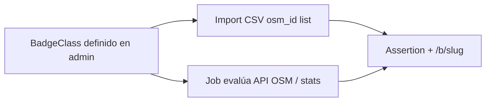
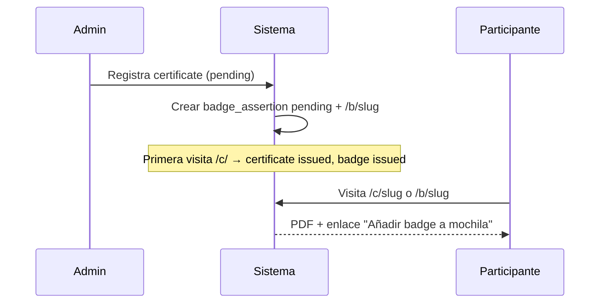

# Open Badges

**Versión:** 1.0  
**Fecha:** 2026-06-06  
**Alcance:** Módulo **integrado** del proyecto (no extensión opcional tardía).

---

## 1. Posición en el producto

Open Badges es un **pilar del sistema**, al mismo nivel que los certificados PDF:

| Credencial | Ruta | Formato | Caso de uso |
|------------|------|---------|-------------|
| Certificado | `/c/{slug}` | PDF / imagen | Eventos, diploma, LinkedIn, AC3 legal |
| Badge | `/b/{slug}` | Open Badge 3.0 (JSON-LD) | Backpack, logros OSM, complemento de evento |

Un certificado de evento **genera automáticamente** un badge vinculado.  
Un badge de actividad OSM **puede existir sin certificado**.

---

## 2. Dos familias de badges

### 2.1. Badge de evento (`type: event_role`)

| Aspecto | Detalle |
|---------|---------|
| Fuente | Emisión de `certificate` (rol en evento) |
| PDF | Sí, en `/c/{slug}` |
| Badge | Sí, en `/b/{slug}` — evidence apunta a `/c/{slug}` |
| BadgeClass | Por evento + rol (ej. "Ponente — Mapathon 2026") |
| Instancias | osm.lat y AC3 |

### 2.2. Badge de actividad OSM (`type: osm_activity`)

| Aspecto | Detalle |
|---------|---------|
| Fuente | Criterio externo o regla OSM |
| PDF | **No** |
| Badge | Sí, solo `/b/{slug}` |
| Ejemplos | Ver catálogo §5.1 (antigüedad, changesets, trazas, …) |
| Instancia | **Solo osm.lat** (AC3 no emite actividad OSM; HOT/TM = instancia futura) |
| Identidad | `osm_id` (+ `osm_username` actualizable); sin cédula ni email en el badge |
| Descubrimiento | Público por osm_id / username |

**Criterios externos — modos de emisión:**



> **v1.0 / Fase 3:** import CSV (M1) y job (M2) solo en **osm.lat**. Webhook: [evolución futura](./01-vision-y-alcance.md#11-evolución-futura-post-v10).

---

## 2.3. Recipient (identidad OB)

- Assertion usa **hash de email + salt** (estilo Open Badges 2 / portable a backpacks).
- Email siempre disponible: es obligatorio en participantes (osm.lat y AC3).
- Badges `osm_activity` se asocian a `osm_id`; el recipient hasheado aplica cuando hay email vinculado o se usa identidad OSM según implementación F3 (detalle en assertion JSON).

**Verificación en v1.0:** páginas humanas `/c/{slug}` y `/b/{slug}` + JSON-LD de assertion. **Sin** API `/api/v1/verify/...` en v1.0.

---

## 3. Mapeo Open Badges 3.0

| OB 3.0 | Entidad en sistema |
|--------|-------------------|
| **Profile (Issuer)** | Config instancia + `badge_issuers` |
| **Achievement (BadgeClass)** | `badge_classes` |
| **VerifiableCredential** | `badge_assertions` |
| **Evidence** | URL `/c/` o perfil OSM / snapshot API |
| **Verification** | `/b/{slug}`, `/badges/assertions/{uuid}.json` |

---

## 4. Issuer por instancia

### osm.lat

```json
{
  "@context": "https://w3id.org/openbadges/v3",
  "type": "Profile",
  "id": "https://certificados.osm.lat/badges/issuer.json",
  "name": "OSM Latam — Certificados y Badges",
  "url": "https://certificados.osm.lat",
  "description": "Certificados de eventos y badges por actividad en OpenStreetMap."
}
```

### AC3

```json
{
  "@context": "https://w3id.org/openbadges/v3",
  "type": "Profile",
  "id": "https://certificados.ac3.org.co/badges/issuer.json",
  "name": "AC3 — Certificados institucionales",
  "url": "https://certificados.ac3.org.co",
  "description": "NIT … Certificados y badges de eventos con aval AC3."
}
```

---

## 5. Ejemplos de BadgeClass

### Evento

```json
{
  "type": "osm_activity | event_role",
  "code": "mapathon-monteria-2026-asistente",
  "name": "Asistente — Mapathon Montería 2026",
  "description": "Participó como asistente en el mapathon.",
  "image_url": "…/badges/images/mapathon-asistente.png",
  "criteria_narrative": "Asistió al evento presencial/virtual del 2 mar 2026.",
  "event_id": "uuid",
  "role_code": "asistente"
}
```

### Actividad OSM — catálogo inicial Fase 3 (§5.1)

Escalas acumulativas (un assertion por BadgeClass al cruzar umbral). Alineación changesets con tramos tipo HDYC en el extremo alto.

| Familia | metric | Umbrales (value) | Esfuerzo job |
|---------|--------|------------------|--------------|
| Antigüedad cuenta | `account_age_years` | 1, 5, 10, 20 | Bajo (API user) |
| Changesets | `changesets_count` | 25, 100, 1000, 10000, 25000, 75000, 100000 | Bajo |
| Trazas GPX | `traces_count` | 1, 10, 100, 1000, 5000 | Bajo |
| Días mapeando | `mapping_days` | 7, 30, 100, 365, 1000, 2000 | Medio |
| Diarios | `diary_entries` | 1, 5, 20, 100 | Alto / CSV hasta fuente estable |
| Amigos | `friends_count` | 1, 10, 50 | Alto / CSV |
| Notas abiertas | `notes_opened` | 1, 10, 100, 1000, 5000 | Alto / CSV |
| Notas cerradas | `notes_closed` | 1, 10, 100, 1000, 5000 | Alto / CSV |

Códigos ejemplo: `osm-changesets-100`, `osm-account-5y`, `osm-traces-1000`.

**Must job F3 (API user):** antigüedad, changesets, trazas.  
**Should:** mapping_days.  
**CSV o evolución:** diarios, amigos, notas.

### Actividad OSM (ejemplo JSON)

```json
{
  "type": "osm_activity",
  "code": "osm-changesets-100",
  "name": "100 changesets en OpenStreetMap",
  "description": "Ha realizado al menos 100 changesets.",
  "criteria_narrative": "Conteo verificado vía API OSM.",
  "criteria_rule": {
    "metric": "changesets_count",
    "operator": ">=",
    "value": 100
  },
  "external_source": "osm_api | manual_import | custom_service"
}
```

---

## 6. Endpoints

| Ruta | Descripción |
|------|-------------|
| `GET /b/{slug}` | Página pública badge + JSON-LD + backpack |
| `GET /badges/issuer.json` | Issuer OB |
| `GET /badges/classes/{id}.json` | BadgeClass |
| `GET /badges/assertions/{uuid}.json` | Assertion JSON-LD |
| `POST /api/v1/admin/badges/import` | Import awardees CSV (osm.lat) |
| `POST /api/v1/admin/badges/sync/{class_id}` | Ejecutar reglas OSM |

> Verificación máquina tipo `/api/v1/verify/...`: fuera de v1.0 (páginas `/c/` y `/b/` bastan).

---

## 7. Flujos de emisión

### 7.1. Certificado de evento → badge automático



### 7.2. Actividad OSM — import externo

```
1. Admin crea BadgeClass "100 notas resueltas"
2. Servicio externo o CSV entrega: `osm_id`, opcional username, …
3. Sistema crea/actualiza `osm_profile` por **osm_id** y emite assertion (idempotente)
4. Usuario visita /b/{slug} o busca por osm_username
5. Opción export OB / Badgr
```

### 7.3. Actividad OSM — job automático

```
1. BadgeClass con criteria_rule (changeset_count >= 100)
2. Job nocturno: usuarios vinculados + consulta API
3. Si cumple y no tiene assertion → emitir
4. Registrar evidence (snapshot fecha + enlace perfil OSM)
```

---

## 8. Identidad y búsqueda

| Tipo badge | Identificador principal | Búsqueda pública |
|------------|----------------------|------------------|
| event_role | email / doc (como certificado) | Formulario eventos |
| osm_activity | **`osm_id`** (username opcional, resuelto vía API) | Formulario "Mis badges OSM" |

**Vinculación:** tabla `osm_profiles` permite unir usuario OSM con email/doc para ver **certificados + badges** en un solo lugar (HU-10.5).

---

## 9. Revocación

| Acción | Efecto |
|--------|--------|
| Revocar certificate | Revoca badge event_role vinculado |
| Revocar assertion OSM | Solo `/b/`; no afecta certificados |
| BadgeClass desactivado | No nuevas emisiones; existentes válidas |

---

## 10. Imagen del badge

- **Evento:** diseño por BadgeClass (admin sube PNG/SVG); puede derivarse de miniatura del certificado.
- **Actividad OSM:** iconografía estándar por tipo (changeset, nota, etc.) configurable.

Editor simple de imagen badge en admin: upload de PNG/SVG. Plantillas reutilizables: [evolución futura](./01-vision-y-alcance.md#11-evolución-futura-post-v10).

---

## 11. Evolución futura

Capacidades OB post-v1.0 (firma OBv3, webhook, plantillas de imagen, reglas OSM ampliadas, etc.): ver la lista canónica en [01 §11](./01-vision-y-alcance.md#11-evolución-futura-post-v10).

---

## 12. LinkedIn y redes

- **Certificados:** Open Graph en `/c/{slug}` (preview PDF).
- **Badges:** Open Graph en `/b/{slug}` (imagen del badge + título del logro).
- LinkedIn no importa OB nativamente; el permalink con buena preview sigue siendo clave.

---

## 13. Referencias

- [Open Badges](https://openbadges.org/)
- [OB v3.0](https://www.imsglobal.org/spec/ob/v3p0/)
- [Visión y alcance — evolución futura](./01-vision-y-alcance.md#11-evolución-futura-post-v10)
- [Modelo de datos](./03-modelo-de-datos.md)
- [Historias de usuario — Épica 9 y 10](./02-historias-de-usuario.md)
