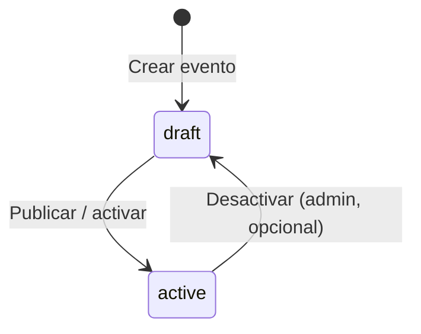
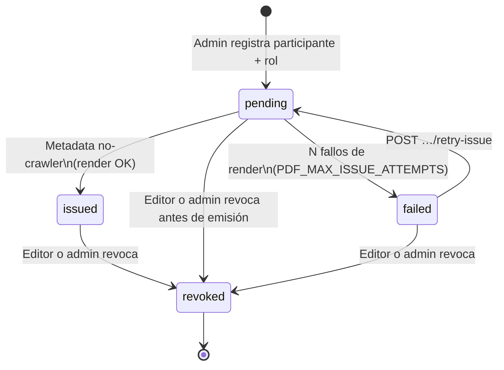
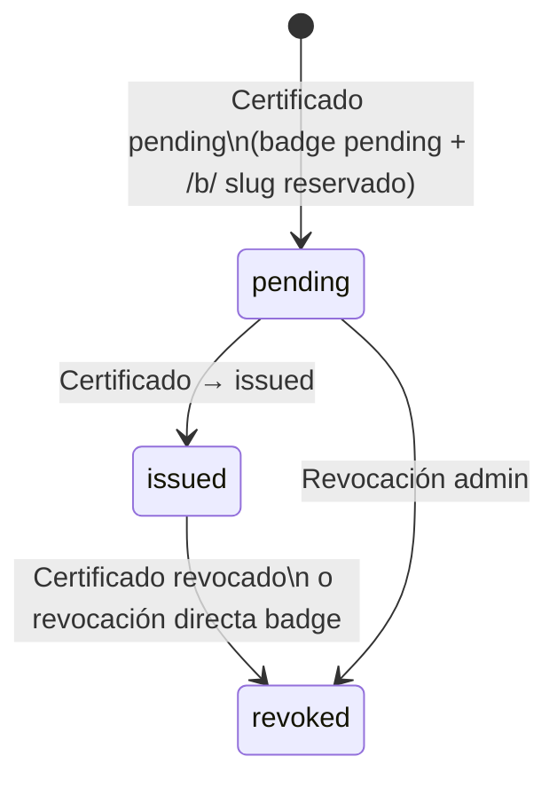
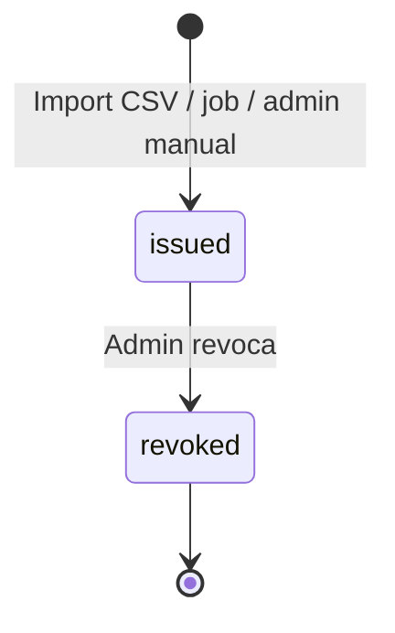

# Estados y ciclo de vida

**Versión:** 1.0  
**Fecha:** 2026-06-06

Este documento responde qué estados existen en el sistema y cómo transicionan. Referenciado desde [HU-6.1](./02-historias-de-usuario.md).

---

## 1. Resumen por entidad

| Entidad | Campo | Valores | ¿Quién cambia? |
|---------|-------|---------|----------------|
| **Evento** | `status` | `draft`, `active` | Admin/editor |
| **Certificado** | `status` | `pending`, `issued`, `failed`, `revoked` | Sistema (lazy / dead-letter) / editor·admin (retry, revoke) |
| **Badge (assertion)** | `status` | `pending`, `issued`, `revoked` | Sistema / editor·admin |
| **Participante** | — | Sin estado propio | — |

El ciclo de vida vive en cada **certificado** y cada **badge**, no en el participante.

---

## 2. Evento (`events.status`)

Valores: `draft` y `active`. Un evento ya realizado sigue `active`; si tiene certificados emitidos o pendientes, el titular los ve en búsqueda y permalink con normalidad.



| Estado | Significado | Búsqueda pública por identidad |
|--------|-------------|--------------------------------|
| `draft` | En preparación; cargando participantes y plantillas | **No** aparece: ningún certificado del evento (tampoco los ya `issued`) |
| `active` | Publicado; emisión y consulta habilitadas (evento pasado o futuro) | Certificados `issued`, `pending` y `failed` visibles al titular |

**Regla:** la fecha del evento no cambia el estado. Un Mapathon de 2019 con certificados sigue `active` y consultable.

**Permalinks en `draft` (decisión cerrada):** `/c/{slug}` y `/b/{slug}` **sí resuelven** (y pueden emitir) aunque el evento **nunca** haya sido `active`. Solo la **búsqueda pública** excluye `draft`.

**`active` → `draft` (desactivar):** regla simple — el evento y **todos** sus certificados salen de la búsqueda pública. Los permalinks `/c/` y `/b/` **siguen resolviendo** (misma política que soft-delete). Sirve para ocultar temporalmente un evento con error sin invalidar enlaces ya repartidos. Volver a `active` restaura la búsqueda.

**Precondición `draft` → `active` (decisión cerrada):**

- Si `pregenerated_only = false` (evento con certificados `generated`): **exige** `default_template_id IS NOT NULL`. Sin plantilla default → **400** (no se publica). Motivo: un `generated` activo sin plantilla deja todos los `/c/` en 503 permanente.
- Si `pregenerated_only = true`: no se exige plantilla (HU-4.2).
- `POST /admin/events` con `status=active` y `pregenerated_only=false` → **400**. El evento `generated` nace **siempre** en `draft` (aún no hay plantilla: FK circular evento↔plantilla). Flujo: crear `draft` → guardar plantilla default → `PATCH` a `active`.
- `PATCH` que pone `pregenerated_only` de `true` a `false` sobre un evento ya `active` exige el mismo `default_template_id`.

La precondición **no** sustituye la validación al alta: en `draft` los permalinks pueden emitir, así que crear un certificado `generated` también exige plantilla resoluble (ver §3 y [03 §4.5](./03-modelo-de-datos.md)).

---

## 3. Certificado (`certificates.status`)



| Estado | Permalink `/c/{slug}` | Descarga PDF | Visible en búsqueda por identidad |
|--------|----------------------|--------------|-----------------------------------|
| `pending` | Existe; metadata no-crawler puede emitir | **409** en `/file` hasta `issued` | Sí |
| `issued` | Activo | Sí | Sí |
| `failed` | Página “no se pudo generar”; metadata **no** lanza Puppeteer | **409** en `/file` | Sí, marcado no generado |
| `revoked` | Muestra revocación | No (o solo metadatos) | Sí, marcado revocado |

### Política de emisión (definida)

1. **Alta editor (HU-6.1):** al guardar participante + roles → se crea un `certificate` por rol en estado **`pending`**. El slug se genera en ese momento (permalink reservado). Aplica a modos `generated` y `pregenerated`.
2. **Activación a `issued` (solo lazy):** únicamente `GET /api/v1/public/certificates/{slug}` (metadata) cuando el cliente **no** es crawler/preview conocido **y** el certificado está `pending`. La SPA `/c/{slug}` y la búsqueda por identidad **siempre** llaman a metadata antes de pedir el binario. **`GET …/file` no emite** — si el certificado sigue `pending` o está `failed`, responde **409 Conflict**. **No** hay emisión forzada/masiva en v1.0.
3. **`issued_at`:** timestamp del paso a `issued` (primera metadata no-crawler exitosa).
4. **Modo `generated`:** al pasar a `issued` se renderiza el PDF (Puppeteer), se guarda en storage y, en AC3, se escribe `legal_snapshot` desde `instance_legal`. Transición con **lock por certificado** (ver [10 §4.2.1](./10-diseno-codigo-y-anexos.md)). **Alta:** si no hay plantilla de rol ni default, **rechazar** (no crear `pending`). Ver §3.1.
5. **Modo `pregenerated`:** el archivo ya está en storage desde el upload; al pasar a `issued` solo se fija `issued_at` y se sirve ese archivo (sin re-render). No usa plantilla ni entra en `failed` por render (un pregenerado sin archivo es error de import, no de emisión).
6. **Revocación (Must F2):** `POST /api/v1/admin/certificates/{id}/revoke` y `POST /api/v1/admin/badges/{id}/revoke`; motivo opcional. Editor o admin. Aplica desde `pending`, `issued` o `failed`.
7. **PDF:** inmutable tras `issued`. **Corrección:** revocar + alta nueva (nuevo slug); no regenerar ni editar el emitido. Restore operativo de desastre = backup pareado BD + MinIO (manual de operación).
8. **Soft-delete del evento:** no cambia el estado del certificado; `/c/{slug}` sigue resolviendo.
9. **Edición en `pending` y `failed`:** permitida (metadatos / reemplazo de alta) en F1+; no aplica a `issued`/`revoked`. Un `failed` se puede borrar y volver a dar de alta. Corregir el *layout* de la plantilla (mismo `template_id`) y luego `retry-issue` es el camino cuando el fondo/fuente estaba roto.
10. **Crawlers / OG:** la metadata puede devolver estado `pending` o `failed` y datos mínimos para preview **sin** llamar a `transitionToIssued`.

### 3.1. Fallo de emisión y dead-letter (`failed`) — decisión cerrada

Un `pending` que **siempre** falla el render (fuente rota, fondo corrupto, timeout) no puede quedarse `pending` + 503 en cada visita: eso relanza Chromium y no hay visibilidad admin.

| Pieza | Contrato |
|-------|----------|
| Columnas | `issue_attempts` INT NOT NULL DEFAULT 0; `last_issue_error` TEXT NULL (código corto, sin stack ni secretos, máx. ~500 chars); `last_issue_attempt_at` TIMESTAMPTZ NULL |
| Umbral | `PDF_MAX_ISSUE_ATTEMPTS` (default **5**) |
| Fallo transitorio | `pending` + `issue_attempts < MAX`: incrementar intentos, guardar error, **HTTP 503**. La **siguiente** visita humana a metadata reintenta. |
| Dead-letter | Al fallar con `issue_attempts` que alcanza `MAX`: `pending` → **`failed`**. Visitas posteriores a metadata: **HTTP 200** `{ status: "failed" }` — **no** lanzan Puppeteer. `/file` → **409**. |
| Códigos de `last_issue_error` | Cerrado: `PDF_TIMEOUT`, `PUPPETEER_CRASH`, `TEMPLATE_MISSING`, `TEMPLATE_ASSET_MISSING`, `RENDER_ERROR` (+ detalle opcional truncado). |
| Admin | Ficha del evento lista `failed` y `pending` con `issue_attempts > 0`. **Must F1:** `POST /api/v1/admin/certificates/{id}/retry-issue` — solo desde `failed` → `pending`, `issue_attempts = 0`. No emite en el POST (sigue lazy). 409 si el status no es `failed`. |
| UNIQUE | El índice parcial `status <> 'revoked'` **incluye** `failed`: ocupa el cupo participante+rol hasta revocar o reintentar. |
| Badge `event_role` | Mientras el certificado está `failed`, el badge sigue `pending`. No se emite. `/b/` no dispara `transitionToIssued`. |

No hay `failed` → `issued` directo, ni `issued` → `failed`. El titular ve el certificado en búsqueda con estado “no generado”. El verificador en `/c/` ve el mismo indicador (no “válido”).

### Badge vinculado (Fase 2+)

Al crear certificado **`pending`** (alta admin):

- Se asegura BadgeClass `event_role` para evento+rol (creada/actualizada al guardar `allowed_roles`, también en `draft`).
- Se crea `badge_assertion` (`event_role`) en **`pending`** con slug `/b/` reservado.

Al pasar certificado `pending` → `issued`:

- Badge pasa a **`issued`**; evidence apunta a `/c/{slug}`.

Si certificado pasa a **`revoked`**, el badge vinculado pasa a **`revoked`**.

---

## 4. Badge (`badge_assertions.status`)

### 4.1. Badge de evento (`event_role`)



| Estado | Permalink `/b/{slug}` | JSON-LD OB |
|--------|----------------------|------------|
| `pending` | Página “aún no emitido” o **404** (configurable UI); **no** dispara emisión del certificado | No exportable |
| `issued` | Verificación + backpack | Sí |
| `revoked` | Estado revocado | `revoked: true` |

**Regla cerrada:** la emisión del certificado (y del badge vinculado) ocurre **solo** en `GET /api/v1/public/certificates/{slug}` (metadata, no crawler) y **solo** si el certificado está `pending` (no `failed`). Visitar `/b/{slug}` o `GET …/file` en `pending`/`failed` **nunca** llama a `transitionToIssued`.

### 4.2. Badge actividad OSM (`osm_activity`)



No hay `pending` habitual: la emisión ocurre cuando el criterio externo confirma elegibilidad. Si el job falla parcialmente, no se crea registro (no hay `pending` huérfano).

---

## 5. Flujo completo — alta admin → consulta pública

```text
1. Admin crea participante + rol asistente
2. Sistema: certificate status=pending, slug /c/abc generado
3. Sistema: badge event_role status=pending, slug /b/xyz reservado (Fase 2+)

--- participante busca ---

4. Participante: búsqueda solo con CC 1234567890
5. Sistema lista todos sus certificados (todos los eventos/años)
6. Participante abre /c/abc → SPA llama metadata → certificate pending→issued, issued_at=now
   (si el render falla N veces → failed; metadata posterior no reintenta hasta POST retry-issue)
7. Sistema: badge pending→issued, evidence=/c/abc  (solo si el certificado llegó a issued)
8. SPA pide /file solo cuando ya está issued (si pending o failed → 409)
```

---

## 6. Referencias

- [HU-6.1](./02-historias-de-usuario.md) — alta individual (exige plantilla resoluble en `generated`)
- [HU-5.1](./02-historias-de-usuario.md) — precondición al activar evento `generated`
- [HU-7.3](./02-historias-de-usuario.md) — revocación y corrección (revoke + alta nueva)
- [Modelo de datos](./03-modelo-de-datos.md) — columnas `status`, `issue_attempts`
- [Flujos funcionales](./04-flujos-funcionales.md) — búsqueda y permalink
- [Diseño de código §4.2](./10-diseno-codigo-y-anexos.md) — contrato metadata / `/file` / crawlers / `failed`
