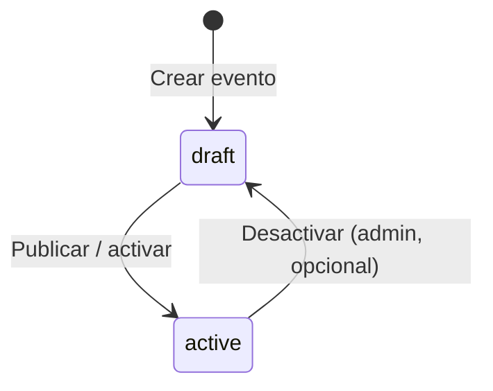
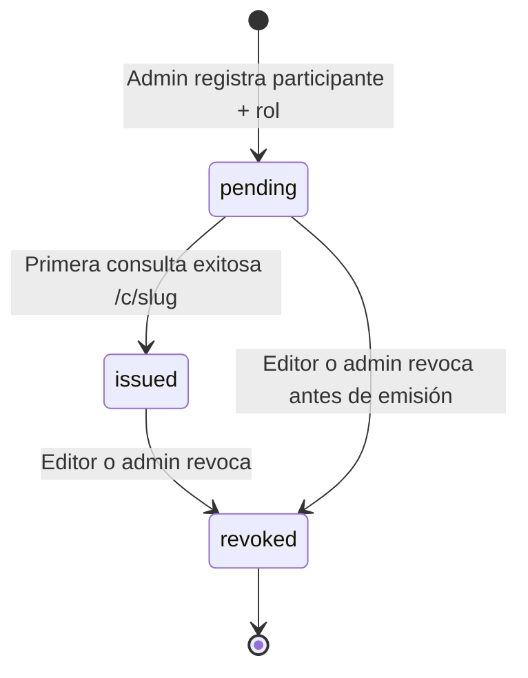
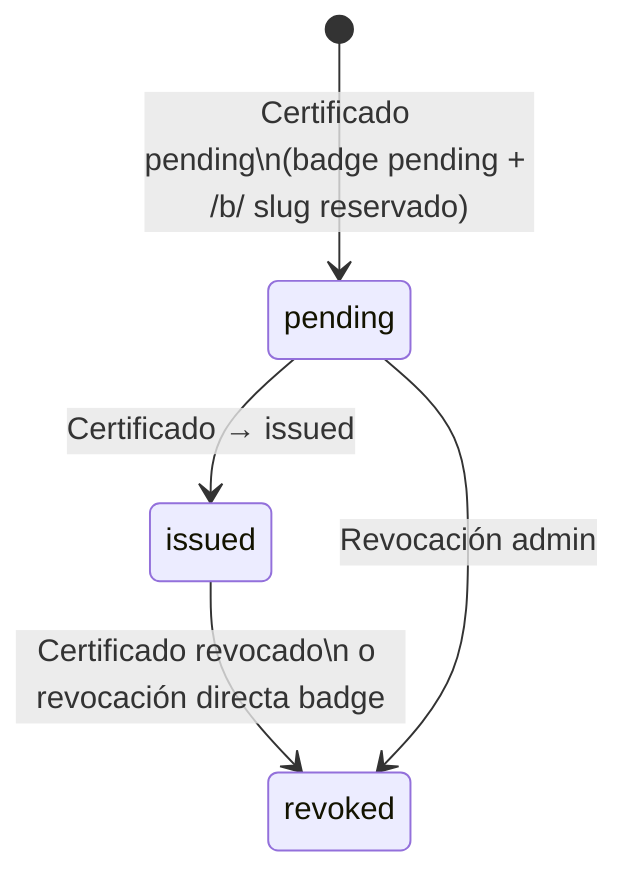
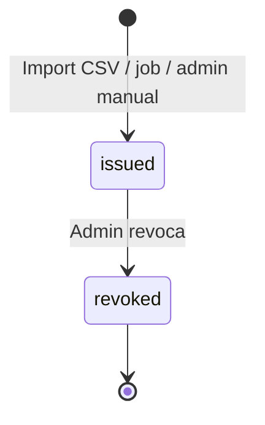

# Estados y ciclo de vida

**Versión:** 1.0  
**Fecha:** 2026-06-06

Este documento responde qué estados existen en el sistema y cómo transicionan. Referenciado desde [HU-6.1](./02-historias-de-usuario.md).

---

## 1. Resumen por entidad

| Entidad | Campo | Valores | ¿Quién cambia? |
|---------|-------|---------|----------------|
| **Evento** | `status` | `draft`, `active` | Admin/editor |
| **Certificado** | `status` | `pending`, `issued`, `revoked` | Sistema (lazy) / editor·admin (revoke) |
| **Badge (assertion)** | `status` | `pending`, `issued`, `revoked` | Sistema / editor·admin |
| **Participante** | — | Sin estado propio | — |

No existe un estado global del “participante”; el ciclo vive en cada **certificado** y cada **badge**.

---

## 2. Evento (`events.status`)

Solo dos estados. **No existe `closed`:** un evento ya realizado sigue `active`; si tiene certificados emitidos o pendientes, el titular los ve en búsqueda y permalink con normalidad.



| Estado | Significado | Búsqueda pública por identidad |
|--------|-------------|--------------------------------|
| `draft` | En preparación; cargando participantes y plantillas | No aparece en resultados |
| `active` | Publicado; emisión y consulta habilitadas (evento pasado o futuro) | Certificados `issued` y `pending` visibles al titular |

**Regla:** la fecha del evento no cambia el estado. Un Mapathon de 2019 con certificados sigue `active` y consultable.

---

## 3. Certificado (`certificates.status`)



| Estado | Permalink `/c/{slug}` | Descarga PDF | Visible en búsqueda por identidad |
|--------|----------------------|--------------|-----------------------------------|
| `pending` | Existe; primera visita puede emitir | Sí, al pasar a `issued` | Sí, visible en búsqueda (como issued) |
| `issued` | Activo | Sí | Sí |
| `revoked` | Muestra revocación | No (o solo metadatos) | Sí, marcado revocado |

### Política de emisión (definida)

1. **Alta editor (HU-6.1):** al guardar participante + roles → se crea un `certificate` por rol en estado **`pending`**. El slug se genera en ese momento (permalink reservado).
2. **Activación a `issued` (solo lazy):** primera visita exitosa del titular al permalink `/c/{slug}` o descarga desde búsqueda por identidad. **No** hay emisión forzada/masiva en v1.0.
3. **`issued_at`:** timestamp del paso a `issued`.
4. **Revocación:** editor o admin; motivo opcional en `revoke_reason` (Must desde Fase 2).
5. **PDF:** inmutable tras `issued`. Restore operativo = backup pareado BD + MinIO (manual de operación).

### Badge vinculado (Fase 2+)

Al crear certificado **`pending`** (alta admin):

- Se crea `badge_assertion` (`event_role`) en **`pending`** con slug `/b/` reservado.

Al pasar certificado `pending` → `issued`:

- Badge pasa a **`issued`**; evidence apunta a `/c/{slug}`.

Si certificado pasa a **`revoked`**, el badge vinculado pasa a **`revoked`**.

---

## 4. Badge (`badge_assertions.status`)

### 4.1. Badge de evento (`event_role`)



| Estado | Permalink `/b/{slug}` | JSON-LD OB |
|--------|----------------------|------------|
| `pending` | No público o “próximamente” | No exportable |
| `issued` | Verificación + backpack | Sí |
| `revoked` | Estado revocado | `revoked: true` |

### 4.2. Badge actividad OSM (`osm_activity`)



No hay `pending` habitual: la emisión ocurre cuando el criterio externo confirma elegibilidad. Si el job falla parcialmente, no se crea registro (no hay `pending` huérfano).

---

## 5. Flujo completo — alta admin → consulta pública

```text
1. Admin crea participante + rol asistente
2. Sistema: certificate status=pending, slug /c/abc generado
3. Sistema: badge event_role status=pending, slug /b/xyz reservado (Fase 2+)

--- participante busca ---

4. Participante: búsqueda solo con CC 1234567890
5. Sistema lista todos sus certificados (todos los eventos/años)
6. Participante abre /c/abc → certificate pending→issued, issued_at=now
7. Sistema: badge pending→issued, evidence=/c/abc
```

---

## 6. Estados que NO existen

Evitar ambigüedad en implementación:

| Término informal | Estado real |
|------------------|-------------|
| “Pendiente de carga” | Participante sin certificados aún (no es status) |
| “Activo/inactivo” del evento | `events.status`, no `certificates` |
| `pendiente` (español) | Usar **`pending`** en código/BD |
| “Expirado” | No aplica; certificados no caducan salvo revocación |
| “Evento cerrado / closed” | No existe; usar `active` (evento pasado sigue consultable) |

---

## 7. Referencias

- [HU-6.1](./02-historias-de-usuario.md) — alta individual
- [HU-7.3](./02-historias-de-usuario.md) — revocación
- [Modelo de datos](./03-modelo-de-datos.md) — columnas `status`
- [Flujos funcionales](./04-flujos-funcionales.md) — búsqueda y permalink
