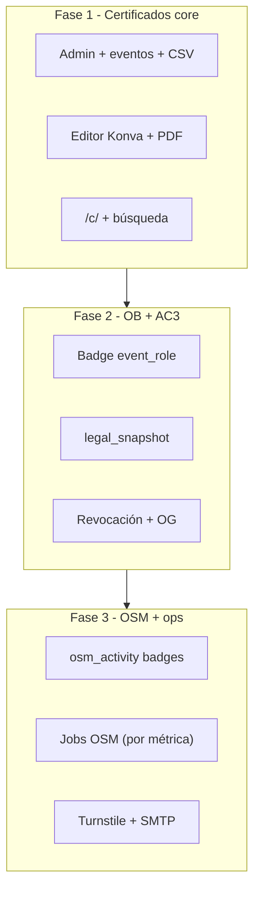

# Plan de implementación — 3 fases

**Versión:** 1.0  
**Fecha:** 2026-06-06  
**Propósito:** Guía para construir el sistema en **tres entregas secuenciales** (humano o IA). Cada fase produce software desplegable y testeable.

Referencias: [01 — Visión](./01-vision-y-alcance.md), [02 — Historias de usuario](./02-historias-de-usuario.md).

---

## 1. Decisiones técnicas (cerradas)

Estas decisiones cierran los huecos que quedaban abiertos en la especificación funcional.

### 1.1. Stack

| Capa | Tecnología | Motivo |
|------|------------|--------|
| Lenguaje | **TypeScript 5.x** | Tipado, ecosistema amplio, bueno para IA |
| Monorepo | **pnpm workspaces** | `apps/api`, `apps/web`, `packages/shared` |
| API | **NestJS 11** | Módulos claros, DI, guards, validación |
| ORM / migraciones | **Prisma 6** + PostgreSQL 16 | Schema declarativo, migraciones reproducibles |
| Validación | **Zod** (shared) + `class-validator` (API) | Contratos compartidos front/back |
| Cola de jobs | **BullMQ** + **Redis 7** (**Fase 3**) | Jobs OSM |
| Almacenamiento archivos | **S3-compatible** (MinIO en dev y **prod en cada servidor**) | PDFs, pregenerados, firmas |
| PDF | **Puppeteer** (HTML → PDF) | Mismo HTML que preview web |
| Frontend | **React 19** + **Vite 6** + **TanStack Query** | Admin + páginas públicas |
| UI admin | **shadcn/ui** + **Tailwind CSS 4** | Componentes accesibles, mantenidos |
| Editor plantillas | **react-konva** (canvas 2D) | Arrastrar capas, exportar `layout` JSONB |
| Auth admin | **OAuth OSM** + sesiones httpOnly (cookie) | Sin password local; sin JWT en localStorage |
| Rate limiting | `@nestjs/throttler` | Búsqueda **y** permalinks públicos (Fase 1) |
| Captcha búsqueda | **Cloudflare Turnstile** (Fase 3) | Anti-abuso adicional; no reemplaza throttle |
| Email | **Nodemailer** + SMTP | Envío de enlace `/c/`; From dedicado |
| Contenedores | **Docker Compose** (dev/prod) | F1: API+web+Postgres+MinIO; Redis desde F3 |
| CI | **GitHub Actions** | Lint, test, build imagen Docker |
| Tests API | **Jest** + **Supertest** | Unitarios + integración HTTP |
| Tests web | **Vitest** + Testing Library | Componentes React |
| BD de test | **PostgreSQL** (contenedor en CI) | Integración con Prisma |
| E2E (opcional) | **Playwright** | Fase 3 — flujos admin/público |

### 1.2. Reglas de negocio cerradas

| Tema | Decisión |
|------|----------|
| **Estado del evento** | Solo `draft` y `active`. **No existe `closed`.** Un evento pasado sigue `active`; si tiene certificados, se muestran en búsqueda y permalink. `draft` = preparación, **invisible en búsqueda**; permalinks `/c/` `/b/` **sí resuelven** (también si nunca fue `active`). |
| **Evento `active` → `draft`** | Sale de búsqueda pública (todos los certificados del evento); permalinks siguen vivos. |
| **BadgeClass event_role** | `UNIQUE (event_id, role_code)`; upsert al guardar `allowed_roles`. `code` estable e **inmutable** al renombrar evento. `GET /badges/classes/{id}.json` si la clase existe (aunque evento `draft`). |
| **Plantillas** | Default = `role_code` NULL + `events.default_template_id`. `UNIQUE (event_id, role_code)`. `template_id` del certificado se **fija al crear pending**. Tokens canónicos: [04 §5](./04-flujos-funcionales.md) (`certificate_slug` ≠ `permalink_qr`). |
| **Emisión certificado** | `pending` → `issued` **solo** vía `GET /api/v1/public/certificates/{slug}` (metadata), si el request **no** es crawler/preview. UI `/c/` y búsqueda llaman siempre a metadata antes de `/file`. Sin emisión forzada/masiva en v1.0. |
| **Datos legales AC3** | Tabla `instance_legal` (singleton) + pantalla admin; ENV `LEGAL_*` solo bootstrap. Al emitir PDF (`issued`, `generated`): copia a `certificates.legal_snapshot` e incrusta en PDF. Cambios posteriores solo afectan emisiones nuevas. |
| **Preview plantilla** | Usa `instance_legal` **actual** (no snapshot). |
| **Pregenerados AC3** | Legal ya va en la imagen subida; no se aplica snapshot. |
| **Slug permalink** | `nanoid` alfabeto `[A-Za-z0-9_-]`, **12 caracteres**; columna `VARCHAR(16)` (margen). |
| **PDF** | A4 **landscape** @ **150 DPI** (canvas 1754×1240 px) en v1.0; tipografías abiertas embebidas; Puppeteer HTML→PDF. El campo `layout.canvas.orientation` existe por forward-compat; el editor **no** ofrece retrato en v1.0. |
| **OAuth OSM** | Solo scopes de lectura de identidad (`read_prefs` o mínimo equivalente); sin escritura en OSM. |
| **Sesión admin** | Cookie `cert_session` + tabla **`admin_sessions`** en PostgreSQL (F1/F2 sin Redis). |
| **Email participante** | Obligatorio; **UNIQUE `(event_id, email)`** normalizado (`trim`+`lower`); duplicado → rechazar. Misma persona + otro rol = OK. |
| **Documento** | Al guardar y buscar: quitar espacios/puntos/comas/guiones; CO → solo dígitos; validar regex **después**. País obligatorio en búsqueda por documento. Detalle: [03](./03-modelo-de-datos.md). |
| **CSV import (participantes y pregenerados)** | Atómico; solo CSV (no ODS nativo); error → 0 filas + informe; luego incremental. |
| **Contrato `/c/`** | SPA HTML verify; API metadata (lazy issue); binario `…/file`. **`/file` en `pending` → 409** (no emite). |
| **Emisión concurrente** | Lock por `certificate_id` en `transitionToIssued`; fallo PDF → `pending` + 503. |
| **Crawlers / Open Graph** | Detectar UA de preview (LinkedIn, WhatsApp, Slack, …): metadata/OG **sin** emitir (`PREVIEW_BOT_UA_REGEX`). |
| **Búsqueda pública** | Solo email **o** (país + tipo + número de documento). Rate limit: **10 req/min/IP**. Documento normalizado al comparar. |
| **Permalinks públicos** | Rate limit: **60 req/min/IP** en `/c/`, descarga PDF y (Fase 2+) `/b/`. |
| **Carga PDF** | `PDF_CONCURRENCY=1` por defecto; PDF `issued` siempre desde MinIO (sin regenerar). |
| **Bots / scrapers** | `robots.txt` + sin sitemap de slugs; Turnstile en búsqueda en Fase 3; crawlers OG no emiten (fila anterior). Ver [10 §10](./10-diseno-codigo-y-anexos.md#10-seguridad-abuso-y-protección-de-carga). |
| **Evento `closed` en búsqueda** | N/A — no hay estado closed. |
| **Verify `/c/` legal AC3** | Muestra datos de `legal_snapshot` del certificado, no config actual. |
| **Issuer OB AC3** | `issuer.json` lee `instance_legal` **actual** (nombre/NIT vigentes para nuevas emisiones). |
| **Badge pending** | Se reserva slug `/b/` al crear certificado `pending`; badge público solo en `issued`. Visitar `/b/` pending **no** emite el certificado. BadgeClass `event_role`: ver fila **BadgeClass event_role**. Imagen default = logo instancia si no hay upload. |
| **Vínculo cert↔badge** | Solo FK `badge_assertions.certificate_id` (sin FK inversa en `certificates`). |
| **Open Badges (formato)** | **v2.0 hosted** (JSON-LD; verificación por URL de assertion). No OBv3 ni `proof` en v1.0 — [01 §11](./01-vision-y-alcance.md#11-evolución-futura-post-v10). Detalle: [06](./06-open-badges.md). |
| **Revocación** | F2 Must: `POST …/certificates/{id}/revoke` y `POST …/badges/{id}/revoke`. Motivo opcional. Cascada cert → badge evento. |
| **Corrección de emitidos** | **Revocar + alta nueva** (nuevo slug). Sin PATCH/regenerar PDF `issued`. UNIQUE parcial excluye `revoked`. En `pending` sí se puede editar/reemplazar (F1+). |
| **Plantilla fondo** | `certificate_templates.background_file_id` → `stored_files`. |
| **Soft-delete evento** | Sale de listados y búsqueda; permalinks `/c/` y `/b/` **siguen vivos**. |
| **OSM — vínculo email (HU-10.5)** | **Must F3 osm.lat.** OAuth público (mismo client, redirect distinto) + cookie `cert_mapper_session` + `mapper_sessions` + `osm_email_link_codes` (TTL 20 min) + SMTP. Vista `/me` solo con sesión. `osm_profiles.email` + `linked_at` (1:1); sin `participant_id`. |
| **OSM — resolución usuario** | `GET https://api.openstreetmap.org/api/0.6/user/{osm_id}.json` |
| **OSM — fuentes de métricas** | **Por métrica**, no un proveedor global. Canónico: [06 §5.1](./06-open-badges.md). Must F3 (`account_age_years`, `changesets_count`, `traces_count`) → **OSM API user**. Sin Overpass obligatorio. |
| **OSM — candidatos del job** | Solo `osm_profiles` con **email vinculado** (`linked_at`). Sin descubrimiento masivo ni listas por BadgeClass. Import CSV (HU-10.2) es el camino masivo sin login. |
| **OSM — CSV awardees** | **`osm_username` obligatorio**; `osm_id` opcional (si viene, debe coincidir). Resolver username→id en el import. |
| **OSM — job schedule** | Cron diario 03:00 UTC (BullMQ repeatable job) |
| **Catálogo BadgeClass OSM inicial** | Canónico: [06 §5.1](./06-open-badges.md) — p. ej. `osm-changesets-100`, `osm-account-5y`, `osm-traces-1000`; métricas `changesets_count`, `notes_closed`, … (osm.lat) |
| **i18n** | **Español** en v1.0; cadenas UI/API externalizadas (archivos de locale) para traducir después sin reescribir lógica. |
| **CSV** | Delimitador fijo **`;`**. UTF-8. Sin detección ni parámetro por import. |
| **Catálogos roles / tipos doc** | Solo **seed YAML** en el repo + `prisma/seed` (redeploy). Sin pantalla admin en v1.0. |
| **Sede (venue)** | Import/alta escriben `certificates.venue_id` (y opcionalmente espejo en participante). Token `venue_name`: lee certificado → fallback `participants.venue_id`. |
| **AC3 “avalado”** | Todos los eventos de la instancia AC3 usan datos legales (`legal.*` / `legal_snapshot` en `generated`). **Sin** flag `endorsed` por evento. |
| **ZIP pregenerados** | MIME `application/zip` (+ archivos internos pdf/png/jpg). Límite lote CSV+ZIP: **100 MB**. Uploads sueltos (fondo, 1:1): **10 MB**. |
| **Soft-delete restore** | Solo SQL: `UPDATE events SET deleted_at = NULL WHERE id = …`. Sin API/UI. Documentado en [11](./11-manuales-ops-y-usuario.md). |
| **Supresión datos titular** | Fuera de v1.0 → [01 §11](./01-vision-y-alcance.md#11-evolución-futura-post-v10). |
| **Hosting código** | GitHub (repo `certificados`) |
| **Hosting producción** | **Servidor comunitario osm.lat** + **servidor institucional AC3** (`ac3.org.co`); Docker Compose en cada uno, datos aislados |

### 1.3. Estructura del monorepo

```
certificados/
├── apps/
│   ├── api/          # NestJS
│   └── web/          # React (admin + público)
├── packages/
│   └── shared/       # tipos, Zod schemas, constantes
├── docker-compose.yml
├── pnpm-workspace.yaml
└── docs/
```

### 1.4. API — prefijo y autenticación

- Base: `/api/v1`
- Admin: cookie **`cert_session`** (`SESSION_COOKIE_NAME`) tras OAuth OSM (`GET /api/v1/admin/auth/osm/callback`)
- Público: sin auth; **throttling obligatorio** en `/public/*`, `/c/*` y (Fase 2+) `/b/*` — ver [10 §10](./10-diseno-codigo-y-anexos.md#10-seguridad-abuso-y-protección-de-carga).

Contratos detallados se generan en Fase 1 (OpenAPI en `apps/api/openapi.yaml`).

---

## 2. Fase 1 — Núcleo de certificados (osm.lat)

**Objetivo:** Emitir y consultar certificados de evento en una instancia. Desplegable en producción para un evento piloto.

**Duración orientativa:** 2–4 semanas (IA + revisión humana).

### 2.1. Entregables

| # | Entregable |
|---|------------|
| F1.1 | Monorepo según [10-diseno-codigo-y-anexos.md §2](./10-diseno-codigo-y-anexos.md), Docker Compose, Prisma schema núcleo |
| F1.2 | Auth admin OAuth OSM + roles `admin` / `editor` + gestión usuarios (HU-7.4) |
| F1.3 | CRUD eventos (`draft`/`active`), sedes, participantes |
| F1.4 | Import CSV participantes + **descarga de plantilla** CSV |
| F1.5 | Plantillas: upload fondo + editor Konva; tokens canónicos `full_name`, `document`, `role_label`, `activity_title`, `event_name`, `venue_name`, `event_date`, `certificate_slug`, `permalink_qr` |
| F1.6 | Generación PDF (Puppeteer) + almacenamiento MinIO; **PDF inmutable** al pasar a `issued` |
| F1.7 | Certificados `generated`/`pregenerated`; import sheet+ZIP (lote ≤ **100 MB**, `;`) + plantilla CSV |
| F1.8 | Estados `pending` → `issued` vía metadata (no crawler); `/file` pending → 409 |
| F1.9 | Permalink público: SPA `/c/{slug}` + API metadata + `/file` (lazy issue con lock) |
| F1.10 | Búsqueda pública por email o documento |
| F1.11 | Multi-rol: un certificado por rol |
| F1.12 | Seed `country_identity_config` (Colombia CC/CE/TI) + roles desde YAML anexos |
| F1.13 | Tests unitarios + integración (ver §11) |
| F1.14 | `GET /health`, `GET /ready` ([10 §8](./10-diseno-codigo-y-anexos.md)) |
| F1.15 | `.env.example` en raíz del repo; seeds YAML + CSV en `docs/anexos/` |
| F1.16 | Anti-abuso y carga: rate limit búsqueda + permalinks, `robots.txt`, semáforo PDF (`PDF_CONCURRENCY`) — [10 §10](./10-diseno-codigo-y-anexos.md#10-seguridad-abuso-y-protección-de-carga) |

### 2.2. Historias de usuario incluidas

| ID | Notas |
|----|-------|
| HU-1.1 | Permalink (OG tags en Fase 2) |
| HU-1.2 | Búsqueda por identidad (solo certificados; badges en F2/F3) |
| HU-1.2b | Sin listado por evento |
| HU-1.3 | Verificación en `/c/` (API JSON en Fase 2) |
| HU-1.4 | Datos correctos en PDF |
| HU-2.1 | Multi-rol |
| HU-3.1 | Editor visual (versión Konva funcional) |
| HU-4.1 | Pregenerados + import sheet+ZIP + plantilla CSV descargable |
| HU-4.2 | Evento `pregenerated_only` |
| HU-5.1 – HU-5.4 | Eventos, sedes, identificación |
| HU-6.1, HU-6.2 | Alta individual + CSV + plantilla descargable |
| HU-7.1 | Login OAuth OSM |
| HU-7.4 | Gestión usuarios panel (asignar roles) |
| HU-8.1 | Branding vía ENV (`SITE_*`) + atribución software (`SOFTWARE_*`, `/about`, health) — [05 §10](./05-personalizacion-multi-instancia.md#10-atribución-del-software-multi-instancia) |

**Fuera de Fase 1:** Open Badges, AC3 legal, revocación, OSM badges, Open Graph, **SMTP** (envío de enlace), dashboard avanzado.

### 2.3. Tablas Prisma (Fase 1)

`country_identity_config`, `roles`, `events`, `venues`, `participants`, `certificate_templates`, `certificates`, `stored_files`, `admin_users`, `admin_sessions`, `audit_log`, `permalink_access_log`.

### 2.4. Criterio de aceptación de fase

```text
1. Admin crea evento active, plantilla, carga 3 participantes (2 roles en uno).
2. Participante busca por cédula → ve todos sus certificados (eventos pasados incluidos).
3. Abre /c/{slug} → pending→issued, descarga PDF correcto.
4. Sube certificado pregenerado → permalink sirve archivo fijo.
5. Evento draft no aparece en búsqueda; permalinks `/c/` en draft **sí** resuelven.
6. Exceso de búsquedas o de hits a /c/ desde la misma IP → 429; segunda visita a /c/ issued no lanza Puppeteer.
```

### 2.5. Prompt sugerido para IA (Fase 1)

> Implementa Fase 1 según `docs/09-plan-de-implementacion.md` sección 2, `docs/10-diseno-codigo-y-anexos.md` (incluir **§10 seguridad/abuso/carga**) y `docs/03-modelo-de-datos.md`. Stack: NestJS + Prisma + React + Puppeteer + Konva. Una instancia osm.lat. Rate limit en búsqueda y permalinks; PDF issued solo desde storage; `robots.txt`. No implementes Open Badges ni capas `legal.*`. Incluye tests (§11), health checks (doc 10 §8), openapi (doc 10 §13), anexos ENV/seeds.

---

## 3. Fase 2 — Open Badges + AC3

**Objetivo:** Badge automático por certificado, instancia institucional AC3, revocación.

**Prerequisito:** Fase 1 desplegada y estable.

**Duración orientativa:** 2–3 semanas.

### 3.1. Entregables

| # | Entregable |
|---|------------|
| F2.1 | Tablas `badge_issuers`, `badge_classes`, `badge_assertions`, `instance_legal` |
| F2.2 | Issuer OB + endpoints JSON-LD + **API verify** `GET /api/v1/verify/c/{slug}` y `/b/{slug}` |
| F2.3 | Badge `event_role`: `pending` al crear certificado; `issued` al emitir certificado |
| F2.4 | Página pública `GET /b/{slug}` + JSON-LD |
| F2.5 | Revocación: endpoints cert + badge (HU-7.3) **Must**; corrección = revoke + alta nueva |
| F2.6 | Config legal AC3: **pantalla admin** + capas `legal.*` en editor |
| F2.7 | `legal_snapshot` en certificado al generar PDF |
| F2.8 | Segundo perfil de despliegue (docker compose / ENV `INSTANCE=ac3`) |
| F2.9 | Open Graph en `/c/` y `/b/` |
| F2.10 | Botón redirect backpack (Badgr / Open Badge Passport URL template) |
| F2.11 | HU-3.2 preview con datos de ejemplo |
| F2.12 | HU-2.2 plantilla distinta por rol (override opcional) |
| F2.13 | Tests unitarios + integración badges, legal_snapshot, revocación (ver §11) |

### 3.2. Historias de usuario incluidas

| ID | Notas |
|----|-------|
| HU-1.5 | Legal AC3 en certificado |
| HU-2.2 | Plantilla por rol |
| HU-3.2 | Preview plantilla |
| HU-7.2 | Dashboard básico (conteos eventos/certificados/badges) |
| HU-7.3 | Revocación |
| HU-8.2 | Config legal AC3 |
| HU-9.1 – HU-9.3 | Badges de evento + issuer |

**Fuera de Fase 2:** badges `osm_activity`, jobs OSM, import awardees, vinculación email/OSM.

### 3.3. Criterio de aceptación de fase

```text
1. Certificado osm.lat issued → badge /b/{slug} verificable (JSON-LD válido).
2. Revocar certificado → badge revocado.
3. Instancia AC3: PDF muestra NIT/rep legal del momento de emisión.
4. Cambiar NIT en config → certificados viejos sin cambios; uno nuevo con NIT nuevo.
5. og:tags presentes en /c/ y /b/.
```

### 3.4. Prompt sugerido para IA (Fase 2)

> Sobre el código de Fase 1, implementa Fase 2 según `docs/09-plan-de-implementacion.md` sección 3, `docs/06-open-badges.md` y `docs/08-datos-legales-ac3-plantilla.md`. Emisión Open Badges = **2.0 hosted**. Añade legal_snapshot. No implementes osm_activity ni jobs OSM. Incluye tests unitarios e integración (§11).

---

## 4. Fase 3 — Badges OSM + operación completa

**Objetivo:** Completar v1.0 osm.lat (badges de actividad OSM) y pulido operativo.

**Prerequisito:** Fase 2 desplegada en osm.lat (AC3 puede quedar solo event_role).

**Duración orientativa:** 2–3 semanas.

### 4.1. Entregables

| # | Entregable |
|---|------------|
| F3.1 | Tablas `osm_profiles`, `mapper_sessions`, `osm_email_link_codes` |
| F3.2 | BadgeClass `osm_activity` + CRUD admin |
| F3.3 | Import CSV awardees (`osm_username` obligatorio → resolver `osm_id`) + descarga de plantilla |
| F3.4 | Job BullMQ sobre perfiles **con email vinculado**: métricas API user (antigüedad, changesets, trazas); mapping_days Should |
| F3.5 | Búsqueda **pública** badges OSM por `osm_id` / username |
| F3.6 | HU-10.5 vinculación OSM ↔ email (**Must**): OAuth público + códigos + `/me` + SMTP |
| F3.7 | Turnstile en formularios públicos |
| F3.8 | SMTP: envío de **enlace** `/c/` (From dedicado; cola prudente) — mismo SMTP que F3.6 |
| F3.9 | Audit log completo (solo rol admin) |
| F3.10 | Seed BadgeClass OSM según catálogo [06 §5.1](./06-open-badges.md) |
| F3.11 | Tests integración OSM (mocks + opcional live) |
| F3.12 | Manual/README operación según outline [11](./11-manuales-ops-y-usuario.md): backup **BD + MinIO** off-host, SMTP reputación, secrets |

### 4.2. Historias de usuario incluidas

| ID | Notas |
|----|-------|
| HU-10.1 – HU-10.6 | Badges actividad OSM |
| HU-10.5 | Vinculación identidad |
| HU-7.2 | Dashboard ampliado (jobs, errores sync) |

Todas las HU **Should** restantes quedan cubiertas en Fases 2–3. Lo listado en [evolución futura](./01-vision-y-alcance.md#11-evolución-futura-post-v10) (p. ej. migración OBv3 + firma) **no** entra en ninguna fase.

### 4.3. Criterio de aceptación de fase

```text
1. Import CSV por osm_username → resuelve osm_id → assertions issued con /b/{slug}.
2. Flujo /me: OAuth público → código email → linked_at; vista unificada certificados + badges OSM.
3. Job nocturno emite badge 100-changesets a usuario **con email vinculado** elegible.
4. Búsqueda pública por osm_id/username lista badges de actividad (sin certificados de terceros).
5. Turnstile activo en búsqueda (rate limit ya desde Fase 1).
6. Matriz HU v1.0 completa (sin ítems de evolución futura).
```

### 4.4. Prompt sugerido para IA (Fase 3)

> Sobre Fase 2, implementa Fase 3 según `docs/09-plan-de-implementacion.md` sección 4 y épica 10 en `docs/02-historias-de-usuario.md`. Incluye HU-10.5 (**Must**): OAuth público, `mapper_sessions`, `osm_email_link_codes`, `/me`, SMTP. Jobs BullMQ solo sobre perfiles vinculados; fuentes por métrica ([06 §5.1](./06-open-badges.md)). CSV awardees por `osm_username`. Emisión OB = **2.0 hosted**. No implementar evolución futura (`docs/01-vision-y-alcance.md` §11). Incluye tests unitarios e integración con mocks OSM (§11).

---

## 5. Diagrama de fases



---

## 6. Evolución futura (post v1.0)

Las Fases 1–3 implementan **solo** la especificación v1.0. El catálogo post-v1.0 (migración OBv3 + firma, webhook, plantillas badge, API terceros, retención MinIO, reglas OSM ampliadas, badges OSM en AC3, otras instancias, etc.) está **solo** en:

→ [01 — Visión y alcance §11](./01-vision-y-alcance.md#11-evolución-futura-post-v10)

No duplicar esa lista aquí ni en otros documentos.

---

## 7. Referencias

- [Visión y alcance (v1.0 vs futuro)](./01-vision-y-alcance.md#10-alcance-de-la-versión-10)
- [Estados y ciclo de vida](./07-estados-y-ciclo-de-vida.md)
- [Datos legales AC3](./08-datos-legales-ac3-plantilla.md)
- [Modelo de datos](./03-modelo-de-datos.md)
- [Flujos funcionales](./04-flujos-funcionales.md)

---

## 8. Matriz HU → fase de implementación

La especificación funcional (v1.0) describe el producto **completo**. Esta matriz indica **cuándo** implementa cada HU una IA, sin contradecir los criterios de aceptación finales.

| ID | Historia | Fase | Notas |
|----|----------|------|-------|
| HU-1.1 | Permalink | **1** + **2** | F1: `/c/` + descarga; F2: Open Graph |
| HU-1.2 | Búsqueda por identidad | **1** + **2** + **3** | F1: certificados; F2: +badges evento; F3: +badges OSM vinculados |
| HU-1.2b | Prohibir listado por evento | **1** | |
| HU-1.3 | Verificación | **1** + **2** | F1: página `/c/`; F2: página `/b/` + API `GET /api/v1/verify/c|b/{slug}` |
| HU-1.4 | Datos correctos | **1** | |
| HU-1.5 | Legal AC3 | **2** | Pantalla admin |
| HU-2.1 | Multi-rol | **1** | |
| HU-2.2 | Plantilla por rol | **2** | Should |
| HU-3.1 | Editor visual | **1** | Konva; capas `legal.*` ocultas hasta F2 |
| HU-3.2 | Preview plantilla | **2** | Should |
| HU-4.1 | Pregenerados + carga masiva (hoja + ZIP) + plantilla CSV | **1** | Plantilla descargable; sin helper de escritorio; status `pending` hasta 1ª visita |
| HU-4.2 | Evento pregenerated_only | **1** | Should |
| HU-5.1 – 5.4 | Eventos, sedes, ID | **1** | Soft-delete: oculta listados/búsqueda; permalinks siguen vivos |
| HU-6.1, 6.2 | Alta + CSV + plantilla | **1** | Datos mínimos por instancia; **envío email enlace = F3** (SMTP) |
| HU-7.1 | Login OAuth OSM | **1** | |
| HU-7.2 | Dashboard | **2** + **3** | F2: conteos; F3: jobs; audit solo admin |
| HU-7.3 | Revocación | **2** | **Must**; endpoints + corrección revoke+nueva |
| HU-7.4 | Gestión usuarios panel | **1** | |
| HU-8.1 | Branding + atribución software | **1** | `SITE_*` + `SOFTWARE_*` ([05 §10](./05-personalizacion-multi-instancia.md#10-atribución-del-software-multi-instancia)) |
| HU-8.2 | Legal AC3 config | **2** | |
| HU-9.1 – 9.3 | Badges evento + issuer | **2** | BadgeClass: UNIQUE evento+rol; code inmutable; clase por URL aunque draft |
| HU-10.1 – 10.4, 10.6 | Badges OSM | **3** | Catálogo [06 §5.1](./06-open-badges.md) |
| HU-10.3 | Job reglas OSM | **3** | Should |
| HU-10.5 | Vincular OSM + evento | **3** | **Must** osm.lat; OAuth público + `mapper_sessions` + códigos + `/me` |

---

## 9. Documentos de lectura por fase (IA)

| Fase | Leer obligatorio | No leer aún |
|------|------------------|-------------|
| **1** | 09 §2, **10**, 03 (§1–5), 04 (§1–7, 10), 07, 02 (épica 1–8 excepto 1.5), 05 (§1–3.1, 7), anexos/ | 06, 08, 04 §12–14 |
| **2** | 09 §3, 06, 08, 04 (§8–12, 15), 02 (épica 9, 1.5, 7.3) | 02 épica 10 |
| **3** | 09 §4, 06 (§2.2, 7.2–7.3), 03 (§6), 04 (§13–14), 02 (épica 10) | — |

---

## 10. Checklist — ¿listo para IA?

| # | Criterio | Estado |
|---|----------|--------|
| 1 | Stack definido (NestJS, Prisma, React, Puppeteer, Konva, MinIO) | ✓ |
| 2 | Hosting producción definido (servidores osm.lat + AC3) | ✓ |
| 3 | Modelo de datos coherente (sin `closed`; `instance_legal`; UNIQUE email; FK badge unidireccional) | ✓ |
| 4 | Estados certificado/badge documentados (`/b/` pending no emite) | ✓ |
| 5 | Tres fases con entregables y criterios de aceptación | ✓ |
| 6 | Matriz HU → fase sin huecos | ✓ |
| 7 | API por fase en flujos (§15) | ✓ |
| 8 | Prompts sugeridos por fase | ✓ |
| 9 | Reglas negocio cerradas (emisión, legal, búsqueda) | ✓ |
| 10 | OpenAPI se genera en código (Fase 1) | Pendiente implementación |
| 11 | Estrategia de pruebas definida (§11) | ✓ |
| 12 | Diseño de código y anexos ([10](./10-diseno-codigo-y-anexos.md)) | ✓ |

**Veredicto:** la documentación está **lista para iniciar Fase 1** con una IA. Cada fase tiene alcance acotado, documentos de entrada, criterios verificables, tests obligatorios y **blueprint de código**.

---

## 11. Estrategia de pruebas

Cada fase **debe incluir tests** antes de darse por cerrada. Los criterios de aceptación (§2.4, §3.3, §4.3) se validan con tests automatizados donde sea posible.

### 11.1. Tipos de prueba

| Tipo | Alcance | Cuándo |
|------|---------|--------|
| **Unitario** | Funciones puras, servicios aislados (mocks de BD/repos) | Cada fase |
| **Integración** | API + PostgreSQL real (contenedor), MinIO mock o local | Cada fase |
| **E2E** | Navegador: OAuth admin → crear evento → permalink | Opcional Fase 3 |

**No** se exigen tests de carga ni pen-test en v1.0.

### 11.2. Stack de pruebas

| Capa | Herramienta |
|------|-------------|
| API unit + integración | **Jest** (incluido en NestJS) + **Supertest** |
| Web componentes | **Vitest** + **React Testing Library** |
| BD test | PostgreSQL en Docker (`docker-compose.test.yml` o servicio CI) |
| OSM APIs (por métrica) | **Mocks** en CI; test live manual opcional |
| Puppeteer PDF | Test de integración con HTML fixture (no comparar pixels) |
| CI | `pnpm test` en GitHub Actions antes de build |

### 11.3. Pruebas por fase

#### Fase 1

**Unitarios (ejemplos):**

- Generación de slug (unicidad, formato).
- Transición `pending` → `issued` en primera visita.
- Validación documento por país (`country_identity_config`).
- Parser CSV participantes (roles múltiples, sede única inferida).
- Resolución de campos de plantilla → payload de render.

**Integración (ejemplos — mapean a T1–T12 en [04-flujos §10](./04-flujos-funcionales.md)):**

| Test | Verifica |
|------|----------|
| OAuth OSM callback → sesión | Admin/editor con rol; sin rol ⇒ 403 en APIs |
| CRUD evento + participante + certificado | Alta multi-rol |
| `GET /c/{slug}` / metadata primera visita (humano) | Emisión + PDF almacenado |
| `GET …/file` mientras `pending` | **409**; no emite |
| Metadata con UA preview | 200 sin emitir |
| `GET /c/{slug}` segunda visita | Mismo archivo (inmutable) |
| `POST /public/search` | Búsqueda por documento; evento draft excluido |
| Rate limit búsqueda / permalink | **429** tras umbral (`THROTTLE_*`) |
| `GET /c/{slug}` issued (2ª visita) | Sirve MinIO; **sin** nueva generación Puppeteer |
| Upload pregenerado | Sirve archivo original |
| Auth guard | Endpoints admin rechazan anónimo |

#### Fase 2

**Unitarios:**

- Copia `instance_legal` → `legal_snapshot` al emitir.
- Creación `badge_assertion` **pending** al alta certificado; pasa a **issued** con el certificado.
- Revocación en cascada certificado → badge `event_role`.

**Integración (T13, T15 + AC3):**

| Test | Verifica |
|------|----------|
| `GET /b/{slug}` | JSON-LD válido, evidence apunta a `/c/` |
| `GET /badges/issuer.json` | Issuer por instancia |
| Revocar certificado | `/c/` y `/b/` en estado revocado |
| Revocar badge OSM | `/b/` revoked; certificados intactos |
| Alta tras revoke mismo rol | Nuevo slug; UNIQUE parcial OK |
| Instancia AC3 | PDF contiene NIT del snapshot; config nueva no altera PDF viejo |
| `GET /api/v1/verify/c/{slug}` | JSON `{ valid: true/false }` |
| Open Graph | Meta tags presentes en HTML de `/c/` y `/b/` |

#### Fase 3

**Unitarios:**

- Idempotencia import CSV (`osm_id` + BadgeClass).
- Evaluación `criteria_rule` (mock respuesta según fuente de la métrica, p. ej. API user).
- Resolución username → `osm_id`.

**Integración (T14, T16):**

| Test | Verifica |
|------|----------|
| `POST /admin/badges/import` | Emite assertions desde CSV |
| Job BullMQ (sync) | Emite badge si cumple regla (mock API) |
| `POST /public/badges/osm` | Lista badges por `osm_id` |
| Rate limit | 429 tras umbral en búsqueda |
| Vinculación HU-10.5 | Certificados + badges unificados tras link |

**E2E opcional:** Playwright — búsqueda pública → abrir `/c/` → descargar PDF.

### 11.4. Convenciones en el repo

```text
apps/api/src/**/*.spec.ts      # unitarios NestJS
apps/api/test/**/*.e2e-spec.ts # integración API (Supertest)
apps/web/src/**/*.test.tsx     # unitarios React
```

Comando raíz: `pnpm test` (ejecuta API + web). CI falla si tests fallan.

### 11.5. Cobertura mínima orientativa

| Fase | Objetivo |
|------|----------|
| 1 | Servicios de dominio críticos ≥ 80%; endpoints públicos y admin principales cubiertos |
| 2 | Flujos badge + legal_snapshot + revocación con integración |
| 3 | Import OSM + job con mocks; sin regresión Fases 1–2 (`pnpm test` completo) |
